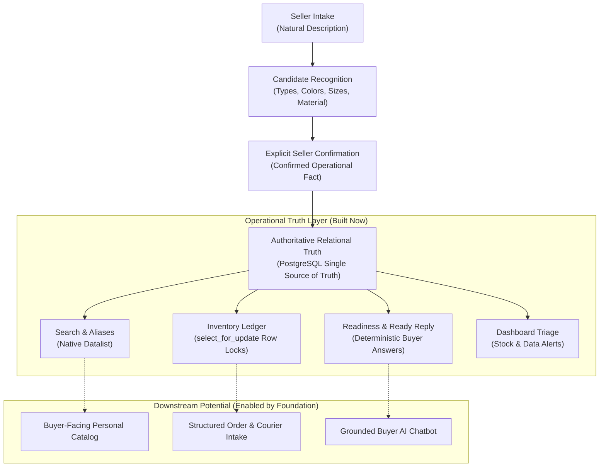

# Social Commerce Seller Operations Assistant

> **Search and automation only work when the product truth behind them is trustworthy — and that truth only survives if maintaining it is low-friction enough for the seller.**

**Social Commerce Seller Operations Assistant** is a seller-first catalog and inventory cockpit for small Instagram and Facebook merchants who operate primarily inside direct messages. Built under a deliberate **~2-month engineering window** as **Portfolio V1**, it turns unstructured natural descriptions into verified catalog truth, exact-choice stock accounting, and deterministic buyer replies before higher-level storefronts, carts, or AI layers are introduced.

[](https://www.python.org/downloads/)
[](https://www.djangoproject.com/)
[](https://www.postgresql.org/)
[](https://htmx.org/)
[](https://github.com/OSINTmedia/facebook_ERP/actions)
[](https://github.com/OSINTmedia/facebook_ERP/actions)

---

## 1. The Core Dependency Chain & Product Thesis

Small social-commerce sellers across Instagram and Facebook operate almost entirely through direct messaging rather than structured web catalogs. Critical product facts—pricing, available sizes, current stock, and fabric composition—are carried in the seller's memory or scattered across team chat threads. This creates operational drag: repetitive buyer questions, contradictory answers, ad-hoc spreadsheet updates, and inadvertent sales of out-of-stock items.

Moving administrative ERP forms onto these sellers fails because of the **"Excel effect"**: rigid, multi-field database administration causes immediate abandonment by solo and small shop teams.

This system reverses that failure mode by enforcing a strict operational dependency chain:

$$\text{Seller Comfort} \longrightarrow \text{Consistent Adoption} \longrightarrow \text{Structured Operational Truth} \longrightarrow \text{Reliable Operations} \longrightarrow \text{Future Automation}$$



---

## 2. Demo Environment & Synthetic Baseline

- **Hosted Demo:** Not published yet *(production-configured runtime; hosting provisioning pending public release)*.
- **Synthetic Demo Account:** `demo@github.ge`
- **Demo Password:** `osint123`
- **Demo Business:** `Seller Studio` (`სელერ სტუდიო`)
- **Deterministic 50-Product Dataset:** The repository contains an authoritative synthetic baseline (`D001`–`D050`) replicating realistic Georgian boutique inventory, ready for local review or hosted execution via `python manage.py demo_lifecycle seed`.

> [!NOTE]
> The demo catalog represents realistic social-commerce inventory ranging from complete entries to lazy, incomplete drafts. All data is purely synthetic, isolated, and safe to evaluate.

---

## 3. What Exists Today (The Implemented System)

Portfolio V1 provides a complete operational workflow on top of a server-rendered Django modular monolith:

### Intake & Operational Truth
- **Description-First Intake:** Natural seller shorthand generates live suggestion candidates in a side-by-side preview without mutating database state.
- **Three-Tier Truth Pipeline:** Strict architectural separation of observed unstructured text, candidate suggestions, and confirmed database facts.
- **Business Vocabulary & Aliases:** Tenant-scoped management of canonical Product Types, Tags, Sizes, and Colors, supporting colloquial, transliterated, and English aliases.
- **Search Assistance:** Fast, browser-native `<datalist>` suggestions fed directly by active canonical terms and aliases.

### Cockpit Operations
- **Product Workspace:** Authenticated, business-scoped operations cockpit with compact cards, pagination, and multi-parameter search/filters.
- **Exact Choice Identity:** Multi-variant inventory (`ProductChoice`) with exact per-choice stock counts, intentionally preserving duplicate-visible choices.
- **Single Mutation Boundary:** Choice-level stock adjustments (`+1`, `-1`, Direct Set) protected by PostgreSQL row-level locks (`select_for_update`).
- **Immutable Ledger:** Every accepted stock change is recorded in `InventoryAdjustment` with actor, timestamp, delta, and prior/new quantities.
- **Controlled Add Similar:** Creates a new draft product with zero stock, new identities, and no ledger or media inheritance.
- **Reversible Lifecycle:** Full support for `draft`, `active`, and `archived` states with safe restore-to-draft.

### Assistant & Triage
- **Readiness Evaluation:** Coverage-based evaluation measuring whether Price, Stock, Size/Color, Type, and Material can answer buyer inquiries.
- **Deterministic Ready Reply:** One-click copyable buyer responses generated strictly from confirmed facts with built-in missing-data warnings.
- **Dashboard Triage:** Real-time operational visibility into out-of-stock items, partially depleted choices, low-stock warnings, and missing-data products.

---

## 4. Assistant Philosophy & The Truth Pipeline

The assistant acts as an operational team member that offloads memory, not as an autonomous generative agent.

### The Truth Pipeline
Unstructured seller notes are never written directly into operational truth. Every catalog fact advances through three explicit stages:

| Information Stage | System Behavior | Authoritative Status |
| :--- | :--- | :--- |
| **Observed Text** | Raw string in `Product.description` (e.g., *"black silk dress M L 189 GEL"*). | Non-authoritative raw input. |
| **Candidate** | Heuristic token/alias recognizer extracts candidate tags, types, sizes, and prices. | Transient suggestion; visible in UI preview only. |
| **Confirmed Fact** | Seller reviews, edits, and saves the structured form. | Authoritative operational fact stored in database tables. |

### Business Vocabulary & Aliases
Social sellers use inconsistent language: English loanwords (`pants`), Georgian terms (`შარვალი`), Russian colloquialisms (`რუბაშკა`), and casual synonyms (`სარაფანი`). The Business Vocabulary manager allows each shop to map aliases to canonical terms. This canonicalization prevents catalog fragmentation (e.g., stopping sellers from creating "Product 1/2/3") while allowing them to search using their natural shorthand.

### Readiness & The Ready Reply Reward Loop
- **Readiness as Buyer-Question Coverage:** Instead of arbitrary "percentage complete" scores, the system evaluates: *"Can the seller confidently answer Price? Stock? Size/Color? Type? Material?"*
- **The Ready Reply:** As soon as truth is confirmed, the seller gains a one-click copyable response for Instagram/Facebook DMs. This immediate utility repays the effort of data entry and encourages continuous data hygiene.

---

## 5. Engineering Architecture & Integrity Guarantees

The project is architected as a modular monolith emphasizing relational consistency and strict domain boundaries.

### Technology Stack
- **Backend:** Python 3.13+, Django 5.2
- **Database:** PostgreSQL with `psycopg` 3 (strict fail-closed rejection of SQLite)
- **Frontend / Rendering:** Django Templates, HTMX v2, Custom Semantic CSS (`app.css`), Vanilla JavaScript (`product_workspace.js`)
- **Asset Pipeline:** Django `ManifestStaticFilesStorage` (immutable, fingerprinted assets; zero Node.js/bundler build dependencies)
- **Testing:** `pytest`, `pytest-django`, Django Test Runner (581 automated tests)

### Architectural Decisions

#### 1. Domain Complexity Over Distributed Systems Complexity
Rather than splitting into a decoupled SPA (React/Node) with duplicated state and API contracts, the system uses server-rendered Django templates enhanced with HTMX and focused vanilla JavaScript. State transitions occur on the server, ensuring validation, authorization, and inventory mutations share one transactional boundary.

#### 2. Strict Tenant Scoping
Every business-owned query, form, view, search suggestion, and inventory mutation is explicitly scoped to the active `Business`. Cross-business object access fails closed with HTTP 404.

#### 3. Concurrency Safety & The Mutation Boundary
Stock adjustments cannot occur through arbitrary form saves. All stock mutations (`+1`, `-1`, Direct Set) converge on a single inventory mutation service:
- Acquires row-level locks via `select_for_update()`.
- Validates non-negative constraints.
- Writes an immutable record to `InventoryAdjustment` capturing actor, timestamp, quantity delta, and old/new totals.
- Re-evaluates computed availability.

#### 4. Duplicate-Visible Choice Identity
In social apparel sales, two items may share visible attributes (e.g., two entries for *"Black / M"* representing distinct fabric weights or supplier batches). The system assigns stable primary key identities to each `ProductChoice` rather than enforcing synthetic unique constraints, preventing the database from making false business assumptions.

#### 5. Centralized Computed Availability

Availability is decoupled from product lifecycle:

**Lifecycle ≠ Availability**

- Lifecycle: `draft`, `active`, `archived`
- Availability: `available`, `partially_sold_out`, `sold_out`

Availability is computed dynamically across active choice quantities, ensuring consistent reporting across Workspace cards, Dashboard triage, and Ready Replies.

#### 6. Fail-Closed Production Runtime
`config.settings.production` strictly enforces mandatory environment configuration (`DJANGO_SECRET_KEY`, `DJANGO_DEBUG=False`, `DJANGO_ALLOWED_HOSTS`, `DATABASE_URL`), enables secure cookies and SSL redirects, and isolates private product media from public static files.

---

## 6. Portfolio V1 Scope — Why It Stops Here

This project was developed within an intentional **~2-month engineering limit**. Rather than building a broad, shallow e-commerce prototype with incomplete carts, mock checkout, and unstable chat scrapers, the scope was deliberately halted at the operational truth boundary.

| BUILT NOW (Verified Foundation) | DELIBERATELY DEFERRED | ENABLED BY THE FOUNDATION |
| :--- | :--- | :--- |
| **Description-first intake & candidate preview** | Public buyer-facing storefront & public catalog | **Buyer personal catalog** consuming authoritative truth |
| **Observed $\rightarrow$ Candidate $\rightarrow$ Confirmed pipeline** | Shopping cart, checkout, & payment processing | **Grounded buyer Q&A chatbot** answering from confirmed facts |
| **Business vocabulary & alias search assistance** | Automated courier booking & delivery tracking | **Structured order intake** capturing choices in chat |
| **Product Workspace & compact operational cards** | Unofficial Instagram/Messenger bot automation | **Richer multi-modal capture** (voice, receipts, OCR) |
| **Exact choice stock & row-locked mutation boundary** | Autonomous LLM operational truth generation | **Tailor & garment specs** (flat specs vs. fit guidance) |
| **Immutable inventory adjustment ledger** | Multi-staff roles & enterprise accounting | **Supplier & restock analytics** |
| **Readiness coverage & deterministic Ready Reply** | Multi-image carousels & unconstrained cloning | **Cross-channel sync APIs** |
| **Dashboard triage & 50-product synthetic demo** | Body-profile algorithms & automated fit sizing | **Smart reorder recommendations** |

### Add Similar vs. Unrestricted Cloning
Traditional e-commerce "clone" features duplicate stale stock, old ledger histories, and outdated media. The system's **Add Similar** feature deliberately enforces clean boundaries: creates a new draft product with new primary key identities, forces `draft` lifecycle, resets stock to 0, discards ledger history, and omits media.

---

## 7. Future Extension Map — "The Iceberg"

Portfolio V1 represents the visible, verified foundation. The underlying architecture is intentionally designed to support several natural extension layers:

### 1. Buyer-Facing Personal Catalog
- **Concept:** A clean, mobile-optimized catalog for buyers to browse active inventory.
- **Architectural Link:** Consumes active products and computed availability directly from the existing seller truth layer. It does not create a duplicate catalog or allow data drift.

### 2. Grounded Buyer Q&A Assistant
- **Concept:** A conversational chatbot deployed on social channels to answer customer inquiries.
- **Architectural Link:** Built directly on the **Ready Reply** and **Readiness** models. The LLM handles natural language understanding and tone, while the truth layer provides verified prices, sizes, and stock.
- **The AI Truth Boundary:**
  $$\text{\textbf{AI may interpret, assist, and communicate. The deterministic truth layer decides what is actually true.}}$$
  No LLM participates in the operational truth path; it cannot invent prices, modify inventory, or override catalog state.

### 3. Structured Order & Courier Intake
- **Concept:** Turning chaotic DM purchase requests into structured orders.
- **Architectural Link:** A conversational assistant collects buyer name, phone, shipping address, and exact choice selection in chat, then submits a single transaction to the existing inventory mutation service.

### 4. Specialized Garment & Tailor Specifications
- **Concept:** Category-specific garment measurements (bust, waist, inseam, rise, sleeve).
- **Architectural Link:** Tailor parameters are not simple numbers; they require category schemas, measurement methods (flat garment width vs. body circumference), fabric elasticity context, and distinct entity ownership. The foundation cleanly separates *measured garment facts* from *inferred buyer fit recommendations*.

---

## 8. Reviewer Walkthrough (Local or Hosted)

To experience the operational workflow:

1. **Sign In:** Navigate to the login page and enter the synthetic credentials (`demo@github.ge` / `osint123`).
2. **Explore Vocabulary Search:** In the **Products Workspace**, type `pants` or `dress` into the search bar. Observe how native `<datalist>` suggestions resolve English and colloquial aliases to canonical Georgian types (`შარვალი`, `კაბა`).
3. **Inspect Product Choice & Adjust Stock:** Open a product card. Use the `+1` / `-1` steppers or Direct Set to change choice quantities. Note the immediate server-rendered update, row-locked ledger creation, and availability recalculation.
4. **Inspect Readiness:** Look at products with incomplete data. Note how missing prices or fabrics trigger clear buyer-question coverage warnings rather than generic percentage bars.
5. **Open Ready Reply:** Click the reply icon on an active product. Review the deterministic response generated from confirmed facts, ready to paste into customer DMs.
6. **Visit Dashboard:** Review the triage dashboard showing sold-out items, partially depleted choices, low-stock alerts, and missing-data flags.

### Verified Demo Archetypes (from 50-Product Catalog)
- **`D001` (Premium Silk Black Slip Dress):** Benchmark golden product with 100% silk composition, active choices S and M, full buyer readiness, and complete Ready Reply.
- **`D021` (Budget Satin Black Slip Dress):** Counterpart to `D001` with identical silhouette but viscose composition and distinct pricing, demonstrating separate identity without false database collision.
- **`D003` (Casual Navy Knit Sweater):** Demonstrates `partially_sold_out` availability where one choice is depleted.
- **`D004` (Red Tailored Evening Blazer):** Demonstrates `sold_out` availability state.
- **`D009` (Minimalist White Organic Tee):** Demonstrates incomplete seller intake (missing price, lazy description, fallback placeholder image).

---

## 9. Local Setup, Testing & Reproducibility

### Prerequisites
- Python 3.13+
- PostgreSQL 14+

### Installation & Environment
```bash
# Clone the repository
git clone https://github.com/OSINTmedia/facebook_ERP.git
cd facebook_ERP

# Create and activate virtual environment
python3 -m venv .venv
source .venv/bin/activate

# Install dependencies (zero Node.js dependencies required)
pip install -r requirements.txt

# Configure environment variables
cp .env.example .env
# Edit .env with your local PostgreSQL credentials
```

### Database & Migrations
```bash
# Verify no pending migrations exist
python manage.py makemigrations --check --dry-run

# Apply migrations
python manage.py migrate
```

### Deterministic Demo Lifecycle
The application includes a scoped management command to seed, reset, or reseed the synthetic 50-product demo dataset:
```bash
# View command options
python manage.py demo_lifecycle --help

# Seed the synthetic 50-product demo catalog
python manage.py demo_lifecycle seed

# Reset or reseed (requires explicit confirmation)
python manage.py demo_lifecycle reset --confirm
python manage.py demo_lifecycle reseed --confirm
```

### Verification & Test Suite
The project enforces rigorous test discipline. Run the canonical test suite:
```bash
# Execute the full PostgreSQL test suite (581 passing tests)
python manage.py test --settings=config.settings.test --noinput

# Run production deployment configuration check
python manage.py check --settings=config.settings.production --deploy
```

---

## 10. Deliberate Non-Goals & Boundaries

To prevent misunderstandings during technical review, the following boundaries are explicitly established:
- **Not a Commercial SaaS Product:** This repository is an engineering portfolio project demonstrating domain modeling, transactional concurrency, and product psychology under a ~2-month build boundary.
- **Not a Public Storefront:** There is no public buyer catalog, customer shopping cart, checkout flow, or payment gateway.
- **Not an Autonomous Chatbot:** The application does not connect to unapproved Facebook/Instagram private APIs, nor does it automatically send messages to buyers.
- **Not an Enterprise ERP:** There are no complex supply-chain logistics, multi-warehouse allocations, employee payroll, or corporate accounting ledgers.
