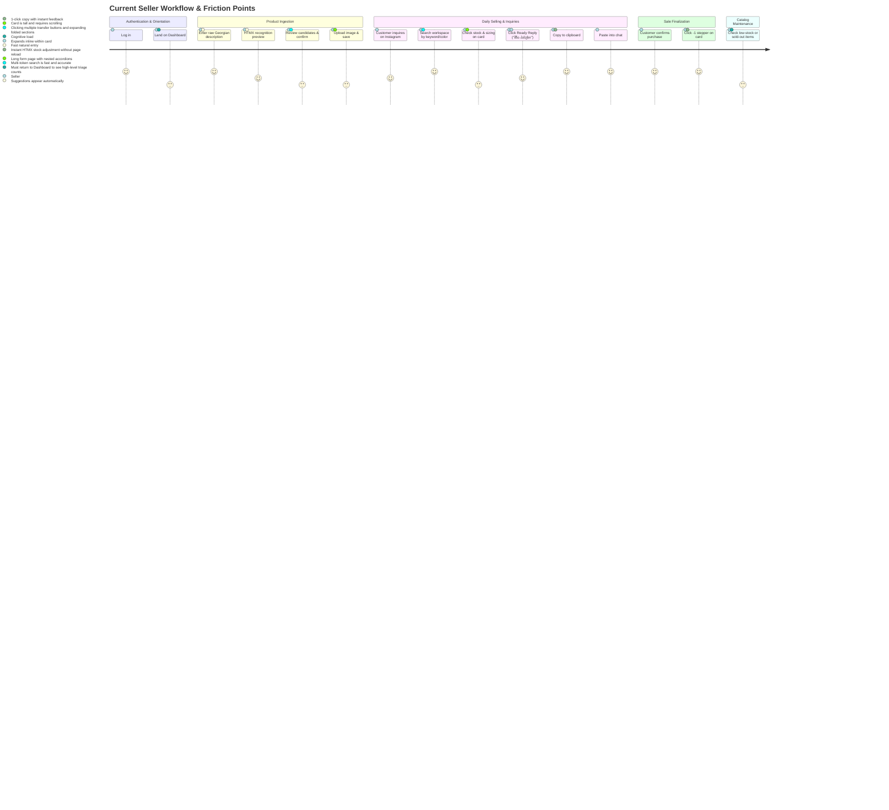
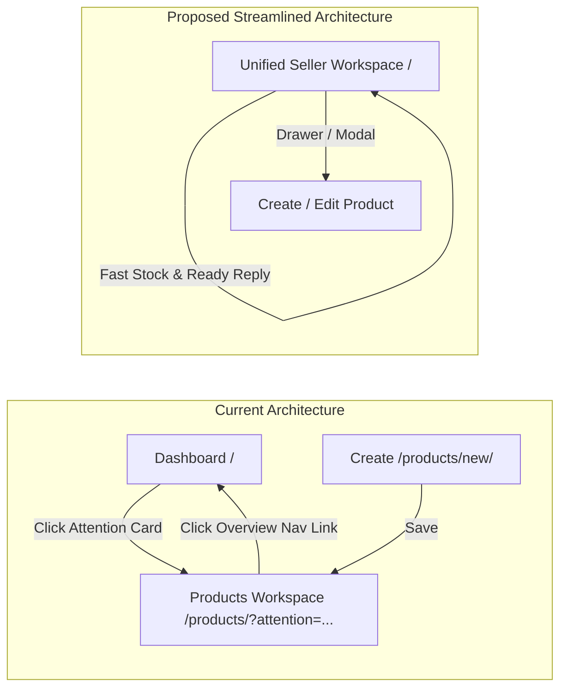

# Pre-Deployment Code Inventory & UX Review

**Date:** March 2025  
**Target Repository:** `/home/giga/Desktop/OSINT/GITHUB_MVP_ERP`  
**Context:** Pre-Phase 13 (Transition from Phase 12 demo hardening into Phase 13 deployment and online portfolio presentation)  
**Primary Authorities:** `docs/PROJECT_BIBLE.md` (durable product truth), current production codebase (implementation reality).  
**Methodology:** Single-pass, read-only multi-lens audit (Django Architecture, UX/UI Product Design, Information Architecture, Seller Operations, Accessibility/a11y, Portfolio Presentation). No runtime execution, database mutations, or test executions performed.

---

## 1. Executive Summary

This enriched pre-deployment review evaluates the actual production software before the Phase 13 public deployment. The application is a focused, single-tenant Georgian-language operating assistant for solo social-commerce sellers (selling via Instagram, Facebook, and WhatsApp).

Rather than acting as an administrative ERP or a bloated ecommerce catalog, the product functions as a **seller-first assistant**: it ingests unstructured Georgian product descriptions, parses vocabulary using deterministic heuristics, enables rapid in-line stock updates (`+1`, `-1`, exact set), evaluates buyer-question readiness across 5 core dimensions, and generates copy-pasteable Georgian chat replies ("მზა პასუხი") with zero external AI hallucination risk.

### Core Audit Takeaways:
1. **Engineered Correctness:** Outstanding Django architecture. Tenant isolation across all domain models is absolute (`Business` scoping enforced at model, queryset, form, and view levels). Concurrency safety for stock operations uses PostgreSQL row locks (`select_for_update`) backed by an immutable ledger (`InventoryAdjustment`).
2. **Special Domain Inquiries:**
   - **Related / Complementary Products ("უხდება", Outfits):** `NOT PRESENT IN CURRENT CODE` and explicitly `DEFERRED BY CURRENT BIBLE` (§2.2). No models, fields, or endpoints exist.
   - **Structured Garment Measurements (Bust, Waist, Inseam, etc.):** `NOT PRESENT IN CURRENT CODE` and explicitly `DEFERRED BY CURRENT BIBLE` (§2.2, §5.3). `MEASUREMENT` exists purely as an unreferenced enum string in `catalog/recognition.py`.
   - **Product Media:** Exactly 1 primary image per product (`OneToOneField`). Multiple gallery images are `PARTIAL / POORLY EXPOSED` in schema and `DEFERRED BY CURRENT BIBLE` for V1.
3. **Primary UX & Operational Friction:**
   - **Mobile Card Scroll Fatigue:** Product cards on mobile viewports ($\le 720\text{px}$, especially ~390px) stretch to 750–950px in height due to permanently unrolled choice lists, quantity steppers, and readiness summaries.
   - **Split Cockpit (Dashboard vs. Workspace):** Sellers are forced to jump between an attention overview screen (`/`) and the operational product list (`/products/`), fragmenting their core daily workflow.
   - **Accordion Overload:** Heavy dependence on native `<details>`/`<summary>` creates an unpolished, "forms-heavy" feel during product creation and exact quantity adjustments.
   - **Ready Reply Drawer Reflow:** Opening a ready reply pushes content downward within the card list, displacing surrounding product cards.

---

## 2. Current Product Capability Map

| Capability / Subsystem | Current Implementation Reality | Status | Code Evidence | Seller-Facing Surface |
| :--- | :--- | :--- | :--- | :--- |
| **Business Workspace & Isolation** | Single-business workspace per user session. Strict GEL currency enforcement. Rejects multi-business ambiguity with HTTP 409. | `IMPLEMENTED` | `businesses/models.py`<br>`businesses/selectors.py` | Global session context; tenant header |
| **Seller Authentication** | Email-based authentication, session management, authenticated route guards. | `IMPLEMENTED` | `accounts/models.py`<br>`accounts/views.py` | `/accounts/login/`, `/accounts/logout/` |
| **Product Lifecycle** | 3 states: `draft`, `active`, `archived`. `active` strictly requires $\ge 1$ choice. Restoring archive defaults safely to `draft`. | `IMPLEMENTED` | `catalog/models.py:Product`<br>`catalog/lifecycle.py` | Workspace card pills, edit dropdown, archive modals |
| **Description-First Capture** | Product name derived automatically from first sentence/chunk of description text. | `IMPLEMENTED` | `catalog/forms.py:ProductForm`<br>`catalog/product_bundles.py` | `/products/new/` primary input |
| **Semantic Recognition Preview** | Heuristic analyzer with 600ms HTMX debounce. Extracts candidates for size, color, product type, tags, and material. | `IMPLEMENTED` | `catalog/recognition.py`<br>`templates/catalog/_recognition_preview.html` | Live suggestion region under description |
| **Transfer Candidate Actions** | Direct transfer of recognized tokens into structured Choice rows or Material Fact rows via HTMX partial re-renders. | `IMPLEMENTED` | `catalog/views.py:ProductMutationBusinessMixin` | "არჩევანში გამოყენება", "მასალად გადახედვა" buttons |
| **Choice Matrix & Duplicates** | Size $\times$ Color combinations with independent stock and active flags. Supports duplicate visible pairs via distinct row IDs. | `IMPLEMENTED` | `catalog/models.py:ProductChoice`<br>`catalog/forms.py:ProductChoiceForm` | Choice section in form; Card choice list |
| **Material Facts** | Canonical fiber, percentage (1–100%), original text, source enum (`manual`, `description`). Negation-safe parsing. | `IMPLEMENTED` | `catalog/models.py:ProductMaterialFact`<br>`catalog/forms.py:ProductMaterialFactForm` | Material section in form; Ready Reply text |
| **Vocabulary & Aliases** | Canonical Types, Tags, Sizes, Colors with alias mappings. Supports inline creation inside product form and standalone manager. | `IMPLEMENTED` | `catalog/vocabulary.py`<br>`catalog/views.py:ChoiceVocabularyView` | `/products/vocabulary/` & inline `<details>` forms |
| **High-Frequency Stock Stepper** | In-place `+1` / `-1` delta buttons on card rows with immediate HTMX re-render and ARIA status updates. | `IMPLEMENTED` | `inventory/views.py`<br>`inventory/mutations.py` | Product card choice rows (`+1`, `-1` buttons) |
| **Exact Stock Setting** | Direct numeric quantity entry tucked inside expandable `<details>` on choice rows. | `IMPLEMENTED` | `templates/catalog/_product_card.html`<br>`inventory/views.py` | "ზუსტი რაოდენობის მითითება" `<details>` |
| **Immutable Inventory Ledger** | Immutable audit trail for all stock transitions: `quantity_before`, `quantity_after`, delta, actor, timestamp, mutation kind. | `IMPLEMENTED` | `inventory/models.py:InventoryAdjustment` | Database/audit ledger (not exposed in seller UI) |
| **Centralized Availability** | Computed states: `available`, `partially_sold_out`, `sold_out`. Decoupled from stored lifecycle. | `IMPLEMENTED` | `inventory/availability.py` | Workspace filter pills, card status pills |
| **Buyer Question Readiness** | Evaluates coverage of 5 essential buyer questions: Price, Stock, Size/Color, Type, Material. No percentage bar. | `IMPLEMENTED` | `catalog/readiness.py` | Card readiness summary & targeted correction link |
| **Ready Reply ("მზა პასუხი")** | Deterministic Georgian response generator. Includes copy-to-clipboard button and seller-only correction alerts with deep links. | `IMPLEMENTED` | `catalog/ready_reply.py`<br>`templates/catalog/_ready_reply_panel.html` | Card drawer/panel with copy feedback |
| **Attention Dashboard** | Triage hub highlighting 4 urgent queues: missing info, low stock, sold out, partial stock. | `IMPLEMENTED` | `dashboard/views.py`<br>`dashboard/attention.py` | `/` (Shell Home / Dashboard) |
| **Product Workspace** | Full catalog search (multi-token, normalized), URL-backed filters, 12-item pagination, page recovery. | `IMPLEMENTED` | `catalog/workspace.py`<br>`catalog/views.py:ProductListView` | `/products/` |
| **Add Similar** | Duplicates product attributes, tags, choices (quantities reset to 0), and material facts into a new Draft. | `IMPLEMENTED` | `catalog/views.py:ProductAddSimilarView`<br>`catalog/cloning.py` | "მსგავსის დამატება" action on product card |
| **Product Archive & Restore** | Safe archiving removing products from daily workspace. Restore returns product as Draft for review. | `IMPLEMENTED` | `catalog/views.py:ProductArchiveView`<br>`catalog/views.py:ProductRestoreView` | Card footer `<details>` and archive filter view |
| **Product Media** | Exactly 1 primary image (JPEG/PNG/WebP, max 5MB). Authenticated streaming view with security headers. | `PARTIAL / POORLY EXPOSED` | `catalog/models.py:ProductMedia`<br>`catalog/views.py:ProductMediaView` | Card thumbnail & form file upload |
| **Related Products ("უხდება")** | Associations between products (outfits, complementary accessories, combos). | `NOT PRESENT IN CURRENT CODE` / `DEFERRED BY CURRENT BIBLE` | Explicitly deferred in `PROJECT_BIBLE.md` §2.2 | None |
| **Garment Measurements** | Structured dimensions (waist, hips, chest, length, sleeve, measurement units). | `NOT PRESENT IN CURRENT CODE` / `DEFERRED BY CURRENT BIBLE` | Explicitly deferred in `PROJECT_BIBLE.md` §2.2 & §5.3 | None |
| **Public Storefront** | Buyer-accessible public catalog or link sharing. | `DEFERRED BY CURRENT BIBLE` | Explicitly deferred in `PROJECT_BIBLE.md` §2.2 | None |
| **Order & Reservation Mgmt** | Customer carts, hold reservations, order status, or payment gateways. | `DEFERRED BY CURRENT BIBLE` | Explicitly deferred in `PROJECT_BIBLE.md` §2.2 | None |

---

## 3. Seller Journey: Step-by-Step Experience & Friction Analysis



### Detailed Interaction & Friction Breakdown:

#### 1. Login $\rightarrow$ Dashboard Orientation
- **Seller Goal:** Start work, check business status, see what needs immediate attention.
- **Current Interaction:** Seller logs in and lands on `/` (Shell Home / Dashboard). Sees 4 attention cards with counts (Missing Information, Low Stock, Sold Out, Partially Sold Out). Clicking a card redirects to `/products/?attention=<category>`.
- **Friction Points:** The Dashboard does not display products directly. It is purely a navigation trampoline. If a seller wants to immediately search for an item or adjust stock, they must take an extra step to click "პროდუქტები" (Products).
- **Redesign Opportunity:** Unify the Dashboard attention metrics into the Product Workspace header as clickable quick-filter chips.

#### 2. Product Capture & Correction
- **Seller Goal:** Ingest a new clothing item as quickly as possible without typing repetitive metadata into 10 fields.
- **Current Interaction:** On `/products/new/`, seller types description into a large textarea. After 600ms of inactivity, HTMX sends a POST preview request. Semantic recognition chips appear. Seller clicks buttons to transfer items into choices or materials. Seller expands folded `<details>` sections for classification, choices, and media.
- **Friction Points:**
  - The recognition chips are helpful, but transferring them requires individual button taps.
  - Sizing choices require expanding `<details id="choice-section">` where forms for adding custom vocabulary sit alongside the actual choice rows.
  - The form is visually tall and disjointed across multiple `<details>` blocks.
- **Redesign Opportunity:** Move to a 2-step structured wizard: Step 1 (Natural description + AI suggestions) $\rightarrow$ Step 2 (Review structured matrix & save).

#### 3. Searching & Locating in Daily Operations
- **Seller Goal:** Locate an item in under 3 seconds while chatting with a buyer on Instagram or WhatsApp.
- **Current Interaction:** Seller enters search terms (e.g., "შავი კაბა M") in the Workspace search bar. Server returns filtered cards paginated 12 per page.
- **Friction Points:**
  - Additional filters (lifecycle, availability, attention) are hidden inside a `<details class="product-workspace-filters">` accordion, making active filter status less immediately scannable on mobile.
- **Redesign Opportunity:** Expose persistent horizontal filter pills above the search results.

#### 4. Stock Adjustment (`+1`, `-1`, Set)
- **Seller Goal:** Decrement stock immediately when an item sells, or increment when new inventory arrives.
- **Current Interaction:** Directly on the card row, seller clicks `−1` or `+1`. HTMX posts the delta, updates the choice row in place, flashes an update status, and updates the total stock pill. Exact numerical adjustment requires clicking `<details class="product-card__stock-set">`, typing a number, and clicking save.
- **Friction Points:**
  - The `+1` / `-1` stepper buttons are small on mobile (~390px) and placed tightly next to the quantity output.
  - Opening exact stock adjustment expands the row vertically, causing layout shift.
- **Redesign Opportunity:** Increase hit areas on mobile steppers to minimum 44px; replace inline `<details>` with a quick popover or modal numeric keypad.

#### 5. Readiness Inspection & Ready Reply
- **Seller Goal:** Answer a buyer's message with verified price, stock, fabric, and sizing details in one paste.
- **Current Interaction:** Seller clicks "მზა პასუხი" on the card. HTMX fetches the reply panel, expanding it inside `#product-ready-reply-slot-<id>`. Seller clicks "პასუხის დაკოპირება" (Copy Reply). Text is copied to clipboard via `navigator.clipboard.writeText`.
- **Friction Points:**
  - Injecting the panel expands the card downwards by 250–350px, pushing all subsequent cards off the screen.
  - On mobile, the copy button requires scrolling down to find it.
- **Redesign Opportunity:** Render Ready Reply as a native bottom sheet on mobile devices with an immediate sticky "Copy & Close" button at the bottom.

#### 6. Catalog Maintenance (Add Similar, Archive, Restore)
- **Seller Goal:** Create seasonal variants (e.g. same dress in new colors) and retire sold-out items without losing historical records.
- **Current Interaction:** Seller clicks "მსგავსის დამატება" to clone into a Draft with quantities reset to 0. Seller archives via a confirmation `<details>` inside the card footer.
- **Friction Points:** The archive action is hidden inside a `<details>` tag that looks like a plain text link, making it non-discoverable or confusing.

---

## 4. Domain & Capability Gaps

```
┌────────────────────────────────────────────────────────────────────────┐
│                        DOMAIN CAPABILITY SPECTRUM                      │
├───────────────────────┬───────────────────────┬────────────────────────┤
│      IMPLEMENTED      │ PARTIAL / UNEXPOSED   │ NOT IN CODE / DEFERRED │
├───────────────────────┼───────────────────────┼────────────────────────┤
│ • Tenant Isolation    │ • Product Media       │ • Related Products     │
│ • Description Capture │   (1 image only)      │   ("უხდება", Outfits)  │
│ • Heuristic Analyzer  │ • Duplicate Choices   │ • Garment Measurements │
│ • Choice Matrix       │   (Row ID disambig-   │   (Waist, Hips, etc.)  │
│ • Material Facts      │    uation is cryptic) │ • Public Storefront    │
│ • Fast Stock Stepper  │ • Inline Vocabulary   │ • Order/Cart System    │
│ • Concurrency Ledger  │   (Clutters choice    │ • Meta/IG API Webhooks │
│ • Readiness (5 Qs)    │    creation form)     │ • Multi-image Gallery  │
│ • Ready Reply Panel   │                       │                        │
│ • Attention Dashboard │                       │                        │
│ • Multi-token Search  │                       │                        │
│ • Add Similar / Clone │                       │                        │
└───────────────────────┴───────────────────────┴────────────────────────┘
```

### Detailed Gap Evaluation:

### 1. Related / Complementary Products ("უხდება", Outfits, Combos)
- **Current Reality:** `NOT PRESENT IN CURRENT CODE`.
- **Bible Stance:** Explicitly `DEFERRED BY CURRENT BIBLE` (§2.2).
- **Domain Impact:** Sellers cannot link a handbag to a dress or trousers to a belt. If a buyer asks "What goes well with this?", the seller must rely entirely on memory.
- **Recommendation:** Keep strictly **DEFERRED** for V1 deployment. Do not add database relations or UI prior to Phase 13.

### 2. Structured Garment Measurements (Waist, Chest, Length, Inseam, Hips)
- **Current Reality:** `NOT PRESENT IN CURRENT CODE`.
- **Bible Stance:** Explicitly `DEFERRED BY CURRENT BIBLE` (§2.2, §5.3).
- **Domain Impact:** Garment sizing in Georgia social commerce is notorious for inconsistent sizing (e.g. Turkish vs. European vs. Chinese fits). Buyers constantly ask for waist and length measurements in centimeters. Currently, sellers can only type this into raw free-text descriptions. It is unvalidated, cannot trigger readiness warnings, and cannot be systematically extracted into Ready Reply.
- **Recommendation:** Keep **DEFERRED** for V1 deployment. In V2, introduce a structured `ProductMeasurementFact` model (measurement type, numeric value, unit cm, flat-vs-circumference flag).

### 3. Product Media (Single Image vs. Gallery)
- **Current Reality:** `PARTIAL / POORLY EXPOSED`.
- **Bible Stance:** Single primary image in V1 (§7.4); multiple images deferred.
- **Domain Impact:** Clothing buyers want to see front, back, fabric close-up, and label. A single image is often insufficient for buyer decision-making.
- **Recommendation:** Maintain single primary image for Phase 13 portfolio demo to minimize storage and upload complexity; prioritize multi-image support for V1.1.

---

## 5. Navigation & Information Architecture

### The Dual-Hub Problem: Dashboard vs. Product Workspace
The system currently provides two primary navigation destinations:
1. **მიმოხილვა (Dashboard - `/`):** Shows attention count cards.
2. **პროდუქტები (Products Workspace - `/products/`):** Hosts search, filters, cards, stock controls, and replies.



### Analysis:
- In daily operations, a seller does not need a static, read-only dashboard. Every time a seller visits the dashboard, their only possible action is clicking through to the Workspace.
- **IA Redesign Direction:** Unify these surfaces. The Product Workspace should be the home page (`/`). The four attention metrics (`needs attention`, `low stock`, `sold out`, `partial stock`) should appear as an interactive "Attention Bar" at the top of the workspace. Clicking an attention chip filters the workspace immediately via HTMX without changing URLs or navigating away.

---

## 6. Product Workspace UX & Mobile Card Density

### Anatomy of the Current Product Card:
Currently, each product card on `/products/` contains:
1. Media image ($4:3$ aspect ratio, up to 16rem height).
2. Header: Title, Price, Product Type.
3. Status pills: Lifecycle state, Availability state, Partial stock flag.
4. Description excerpt (clamped to 2 lines on mobile).
5. Choice heading: Active choices count, total stock count, inactive count.
6. Choice list: For **every** choice row:
   - Row ID, Size name, Color name, Attention pill.
   - Stock stepper form: `−1` button, current quantity output, `+1` button.
   - Expandable `<details>` for exact quantity setting.
7. Readiness section: Ready questions list, Missing questions list, targeted fix button.
8. Card actions footer: "მზა პასუხი", "რედაქტირება", "მსგავსის დამატება", and collapsible `<details>` for "დაარქივება".
9. Ready Reply drawer container.

### The Mobile Height Problem:
On a mobile device at $\sim 390\text{px}$ width (iPhone 13/14/15/16 baseline):
- A product with 4 choices measures approximately **$850\text{px}$ to $1,050\text{px}$** in vertical height.
- A standard mobile viewport is $\sim 844\text{px}$ tall (with browser chrome leaving $\sim 700\text{px}$ usable).
- **Result:** A single product card occupies more than $1.3$ viewports! Browsing through 12 products requires scrolling through over **$10,000\text{px}$** of vertical DOM height.

```
CURRENT MOBILE CARD (~900px)           PROPOSED COMPACT CARD (~340px)
┌─────────────────────────────────┐    ┌─────────────────────────────────┐
│ [Image: 220px]                  │    │ [Thumb 90px] Title, Price, Type │
├─────────────────────────────────┤    │              Total Stock Pill   │
│ Title, Price, Product Type      │    ├─────────────────────────────────┤
├─────────────────────────────────┤    │ Quick Choice Badges:            │
│ Status Pills (3 pills)          │    │ [S/Black: 2] [M/Black: 0]       │
├─────────────────────────────────┤    ├─────────────────────────────────┤
│ Description Excerpt             │    │ [ მზა პასუხი ]  [ მართვა ▼ ]    │
├─────────────────────────────────┤    └─────────────────────────────────┘
│ Choice #1: S / Black            │      (Tapping "მართვა" expands stock
│ [ -1 ]  [ 2 ]  [ +1 ]           │       steppers in a focused sheet)
│ ► ზუსტი რაოდენობა               │
├─────────────────────────────────┤
│ Choice #2: M / Black (Sold Out) │
│ [ -1 ]  [ 0 ]  [ +1 ]           │
│ ► ზუსტი რაოდენობა               │
├─────────────────────────────────┤
│ Readiness: ფასი, მარაგი, ტიპი   │
│ აკლია: მასალა  [შესწორება]       │
├─────────────────────────────────┤
│ [ მზა პასუხი ] [ რედაქტირება ]  │
│ [ მსგავსის დამატება ]           │
│ ► დაარქივება                   │
└─────────────────────────────────┘
```

---

## 7. Create / Edit / Correction UX Review

### Strengths:
1. **Description-First Philosophy:** The prominent textarea with the bold label "დაიწყეთ აქ — აღწერეთ პროდუქტი" immediately guides the seller to paste or type naturally.
2. **Real-Time Recognition Feedback:** The 600ms debounced HTMX trigger updates candidate chips without disrupting typing flow.
3. **Deep-Linked Corrections:** Readiness gaps link directly to specific form sections using anchor hashes (e.g. `#material-section`), focusing the relevant input immediately.

### Weaknesses & Redesign Opportunities:
1. **Accordion Fatigue:** The form wraps Materials, Classification (Type/Tags), Choices, and Media in separate `<details>` tags. Sellers frequently miss sections or have to toggle multiple accordions to complete entry.
2. **Inline Vocabulary Form Clutter:** Inside `<details id="choice-section">`, the forms to add new sizes and colors to the business vocabulary are displayed right above the choice rows. This creates cognitive noise: the seller is trying to add inventory for a specific item, but is confronted with system-level taxonomy editors.
3. **Save Button Visibility:** The primary submit button is located at the very bottom of the page. On mobile, after editing a choice in the middle of the form, the seller must scroll past all remaining sections to find "შენახვა". A sticky bottom bar would eliminate this friction.

---

## 8. Responsive / Mobile UX Analysis (~390px Viewport)

Inspecting `static/css/app.css` at `max-width: 720px` reveals key mobile behaviors:
1. **Header Collapse:** The navigation collapses cleanly into a vertical flex column (`.app-header__inner { flex-direction: column; }`). Tap targets meet the 44px minimum height standard.
2. **Search Input & Button:** The search input and submit button stack or stretch properly (`grid-template-columns: minmax(0, 1fr) auto;`).
3. **Stock Control Layout:** On mobile, choice stock controls convert to a 3-column grid:
   ```css
   .product-card__stock-form {
     display: grid;
     width: 100%;
     grid-template-columns: 2.75rem minmax(3.75rem, 1fr) 2.75rem;
     gap: 0.5rem;
   }
   ```
   This is functional and easy to tap, but because it is repeated for every single choice on every card, it inflates page length excessively.
4. **Horizontal Overflow Safety:** All containers employ `min-width: 0`, `overflow-wrap: anywhere`, and strict box-sizing, completely preventing horizontal side-scrolling bugs on narrow devices.

---

## 9. Accessibility, Feedback, and Failure Recovery

### Audit of Accessibility Features (`static/js/product_workspace.js` & CSS):
- **ARIA Live & Syncing:** Excellent programmatic accessibility. The script automatically synchronizes `aria-invalid`, `aria-errormessage`, and `aria-describedby` when server-side form errors are swapped in by HTMX (`syncFieldErrors()`).
- **Stock Feedback Announcements:** Live stock updates announce to screen readers using `role="status"` and `aria-atomic="true"`.
- **Keyboard Navigation & Esc Key:** The Ready Reply panel listens for the `Escape` key (`keydown` handler) to close cleanly and return keyboard focus to the opening trigger button.
- **Focus Rings:** Distinct 3px solid focus rings with offset (`outline: 3px solid var(--color-accent)`) ensure high visibility for keyboard users.
- **Color-Independent Status:** Status pills combine text labels with color badges (`მზადაა`, `აკლია`, `მარაგშია`, `ამოიწურა`), fully satisfying WCAG requirements for non-color-dependent information.
- **Network Failure Recovery:** If HTMX fails due to network dropouts or server timeouts (`htmx:sendError`, `htmx:timeout`), dedicated error alert blocks (`#product-workspace-transport-error`, `#product-form-transport-error`) are automatically unhidden and focused, providing clear Georgian instructions and manual reload buttons.

---

## 10. Visual System Review

- **Color Palette & Contrast:**
  - Background: `#f7f8fa` (Neutral light gray)
  - Surface: `#ffffff` (Clean card background)
  - Text: `#101828` (High contrast, AAA compliance against white)
  - Accent / Primary: `#0f766e` (Deep teal, 7.3:1 contrast ratio against white — excellent)
  - Accent Soft: `#e6f4f1` (Subtle teal tint for pills and highlights)
  - Danger / Error: `#b42318` (Clear crimson red)
- **Typography:** Uses clean system font stacks (`Inter, ui-sans-serif, system-ui`). Font sizes follow an intentional scale: `0.8rem` (small notes/pills) $\rightarrow$ `0.9rem` (body/labels) $\rightarrow$ `1.1rem` (card titles) $\rightarrow$ `2.0rem` (page titles).
- **Controls & Buttons:** Buttons have consistent 2.75rem (44px) touch targets with bold weights. Secondary buttons have clean borders (`#d7dee8`) that visually distinguish them from primary accent buttons.
- **Perceived Polish:** The visual foundation is remarkably clean, modern, and sturdy. It avoids the typical "clunky Django admin" appearance, presenting a bespoke, high-quality SaaS aesthetic.

---

## 11. Pre-Deployment Redesign Candidates

| # | Theme | Current Problem | Seller Impact | Recommendation | Backend Impact | Scope | Timing Suggestion |
| :- | :--- | :--- | :--- | :--- | :--- | :--- | :--- |
| **R1** | **Navigation & IA** | Separate Dashboard (`/`) and Products (`/products/`) routes force unnecessary context switches. | Seller must leave workspace to check attention queues, adding clicks and cognitive load. | Merge attention queues into the Product Workspace header as interactive filter chips. | Low (view aggregation) | Medium | **Pre-deployment redesign** |
| **R2** | **Workspace Card Density** | Product cards display all choices, steppers, and readiness details expanded, creating 900px+ mobile cards. | Excessive scrolling on mobile; scanning catalog is slow and exhausting. | Implement compact card layout: show summary row + total stock pill; expand choice steppers on tap. | None (template/CSS only) | Medium | **Pre-deployment redesign** |
| **R3** | **Ready Reply Presentation** | Ready Reply panel injects into the card DOM, pushing subsequent cards down by 300px. | Disorienting layout reflow; copy button requires scrolling on mobile. | Render Ready Reply as an overlay bottom sheet on mobile devices. | None (CSS/JS update) | Small | **Pre-deployment redesign** |
| **R4** | **Form Disclosures** | Nested native `<details>` accordions in product form feel clunky and hide required fields. | Sellers miss sections or get frustrated toggling accordions repeatedly. | Replace `<details>` with clean styled cards/sections with smart progressive collapse. | None (template/CSS only) | Small | **Optional pre-deployment** |
| **R5** | **Vocabulary Separation** | Adding sizes/colors to business vocabulary is embedded directly inside the choice creation formset. | Clutters daily product entry with global taxonomy administration. | Move vocabulary addition to a lightweight modal or dedicated slide-over. | Low (HTMX endpoint exists) | Small | **Optional pre-deployment** |
| **R6** | **Sticky Form Actions** | Save button on product form sits at the very bottom of a tall page. | Mobile sellers must scroll to the very end of the page to save changes. | Add a sticky bottom action bar on mobile viewports for "შენახვა" and "გაუქმება". | None (CSS only) | Small | **Pre-deployment redesign** |
| **R7** | **Exact Stock Interaction** | Exact quantity adjustment is hidden inside `<details>` on each row, causing layout reflow when opened. | Clumsy to use when receiving bulk inventory shipments. | Use a quick number popover or inline input that replaces the stepper on double-tap. | None (template/JS) | Small | **Optional pre-deployment** |
| **R8** | **Persistent Filter Bar** | Workspace filters are collapsed inside `<details>` and lack visual active indicators. | Sellers forget active filters are applied, leading to confusion over "missing" products. | Expose horizontal filter chips (All, Active, Low Stock, Draft) with clear counts. | None (template/CSS) | Small | **Pre-deployment redesign** |

---

## 12. Product Experience Ideas — Designer Recommendations

> **NOTICE: RECOMMENDATION — NOT CURRENT PRODUCT AUTHORITY**  
> The ideas in this section are exploratory product experience proposals designed to maximize seller speed, reduce cognitive friction, and elevate portfolio appeal. They adhere strictly to canonical source-of-truth invariants and do NOT expand commercial scope into ERP/CRM domains.

### Idea 1: The "Seller Quick-Dock" (Unified Attention & Action Cockpit)
- **Status:** `RECOMMENDATION — NOT CURRENT PRODUCT AUTHORITY`
- **Seller Problem Solved:** Eliminates the cognitive divide between "Looking at my business" (Dashboard) and "Doing my work" (Product Workspace).
- **Concept:** Transform `/` into the unified Product Workspace. At the very top, place 4 dynamic indicator pills:
  - `ყურადღება (3)`: Filter to items missing price or material.
  - `მარაგი ეწურება (2)`: Filter to choices with $\le 2$ items remaining.
  - `ამოიწურა (4)`: Filter to sold-out products.
  - `ყველა (24)`: Show all products.
  Clicking any pill immediately filters the list below via HTMX without page reloads.
- **Why It Fits:** Maintains canonical availability calculations; adheres to the Bible's $\le 3$ navigation surfaces rule (§3.2).
- **Implementation Impact:** Low. Reuses existing `dashboard/attention.py` queries inside `catalog/views.py:ProductListView`.
- **Pre-Deployment Timing:** **Strong candidate for pre-deployment UX polish.**

### Idea 2: Compact "Scan-First" Product Cards with Expandable Stock Deck
- **Status:** `RECOMMENDATION — NOT CURRENT PRODUCT AUTHORITY`
- **Seller Problem Solved:** Solves the 900px vertical card height problem on mobile phones.
- **Concept:** Default the card to a compact height of $\sim 140\text{px}$ on mobile:
  - Left: 90px square thumbnail.
  - Right: Title, Price in bold, Total Stock badge (e.g. `მარაგშია: 8 ცალი`), and two primary buttons: `[მზა პასუხი]` and `[მართვა]`.
  - Tapping `[მართვა]` slides down the choice rows with large, thumb-friendly `+1`/`-1` steppers.
- **Why It Fits:** Sellers can scan 20 products in 5 seconds while chatting with customers, expanding only the item they are actively selling.
- **Implementation Impact:** Medium (CSS grid and lightweight Alpine.js/HTMX toggle).
- **Pre-Deployment Timing:** **Highly recommended pre-deployment.**

### Idea 3: Mobile "Chat-Ready" Bottom Sheet for Ready Reply
- **Status:** `RECOMMENDATION — NOT CURRENT PRODUCT AUTHORITY`
- **Seller Problem Solved:** Eliminates in-card reflow and ensures the "დაკოპირება" (Copy) button is always directly under the seller's thumb.
- **Concept:** When the seller clicks "მზა პასუხი", instead of expanding inside the card, open a clean native-feeling bottom sheet overlay.
  - Displays the formatted Georgian text in an auto-resizing block.
  - Floating sticky button at the base of the screen: `[დაკოპირება და დახურვა]` (Copy & Close).
  - Tapping copies the text, triggers a green success toast ("დაკოპირებულია!"), and closes the sheet immediately so the seller can switch back to Instagram.
- **Why It Fits:** Exactly mirrors the high-speed interaction model of mobile chat sellers.
- **Implementation Impact:** Small (CSS fixed bottom sheet + existing JS clipboard logic).
- **Pre-Deployment Timing:** **Highly recommended pre-deployment.**

### Idea 4: 2-Step Conversational Creation Wizard ("Magic Description Intake")
- **Status:** `RECOMMENDATION — NOT CURRENT PRODUCT AUTHORITY`
- **Seller Problem Solved:** Replaces the intimidating, tall product form with a guided assistant feel.
- **Concept:**
  - **Step 1 (Express Intake):** A single clean card: paste product description, upload photo, set price. Below it, the live recognition engine automatically parses sizes, colors, and materials.
  - **Step 2 (Confirm & Stock):** A synthesized review table showing generated choices with default quantities. Seller taps to adjust numbers, then clicks "შენახვა".
- **Why It Fits:** Directly fulfills the Project Bible thesis: *"the easiest seller action should gradually create better structured truth."*
- **Implementation Impact:** Medium (refactoring `product_form.html` into a multi-step client flow; backend `ProductBundle` logic remains unchanged).
- **Pre-Deployment Timing:** **Optional pre-deployment or early V1.1.**

---

## 13. What NOT to Add Before Deployment (Anti-Scope-Creep Guardrails)

To protect the integrity of Phase 13 deployment and avoid delaying portfolio release, the following attractive features must **NOT** be built before deployment:

1. **DO NOT build Related Products ("უხდება")**: Requires new relation models, bidirectional graph logic, and workspace UI changes. Explicitly deferred to V2 by Bible §2.2.
2. **DO NOT build Garment Measurements**: Requires unit conversion, flat vs. circumference handling, and category-specific measurement models. Explicitly deferred to V2 by Bible §5.3.
3. **DO NOT build Multi-Image Gallery**: Involves image reordering, client-side thumbnail carousel libraries, and storage migrations. The single primary media model fulfills V1 requirements.
4. **DO NOT build Direct Meta/Instagram Messenger Webhooks**: High API complexity, OAuth token refresh cycles, and external service failure modes that do not belong in a self-contained Django portfolio demonstration.
5. **DO NOT build Public Buyer Storefront**: `active != published`. The current project is an operating assistant for the seller, not a public storefront.
6. **DO NOT introduce Heavy JavaScript Frameworks (React/Vue)**: The server-rendered Django + HTMX + minimal JS architecture is an intentional, portfolio-grade demonstration of lightweight modern web engineering.

---

## 14. Owner Decision List

Before commencing pre-deployment implementation, the owner should decide on the following prioritized architectural and UX questions:

1. **Cockpit Unification:**  
   *Decision:* Should we unify the Dashboard attention metrics directly into the Product Workspace header (`/`) as interactive filter chips, deprecating the separate `/` dashboard page?  
   *Recommendation:* **YES**. This dramatically streamlines navigation, eliminates redundant route jumps, and satisfies the $\le 3$ surfaces rule.

2. **Mobile Product Card Redesign:**  
   *Decision:* Should we adopt the compact card pattern (collapsed choice steppers, reduced mobile card height) before public deployment?  
   *Recommendation:* **YES**. The current 900px+ mobile card height is the single most noticeable UX friction point on mobile viewports.

3. **Ready Reply Presentation:**  
   *Decision:* Should Ready Reply be refactored from an in-card expanding container to a mobile bottom sheet?  
   *Recommendation:* **YES**. It prevents disorienting layout reflow and places the copy action in the thumb zone.

4. **Creation Flow Accordion Polish:**  
   *Decision:* Should we polish the existing `<details>` accordions in `product_form.html` before Phase 13, or defer the 2-step creation wizard to post-deployment?  
   *Recommendation:* **Keep single page with polished CSS cards for Phase 13**; defer the full 2-step wizard to post-deployment.
