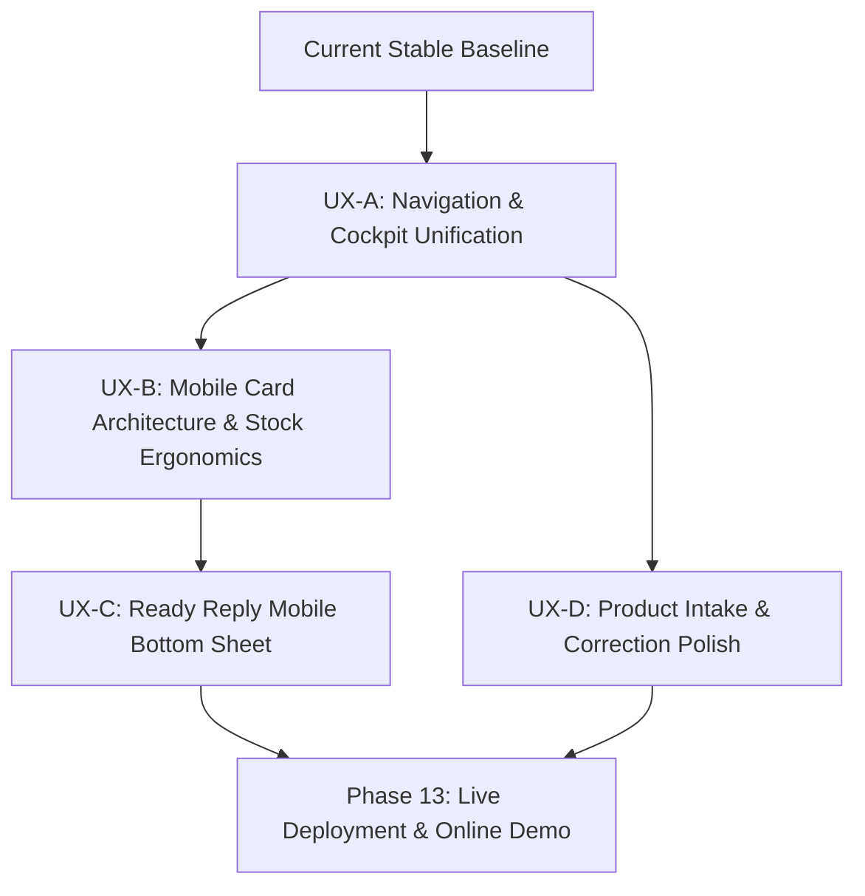

# Pre-Phase-13 Remaining Work & Product Experience Analysis

**Date:** March 2025  
**Target Repository:** `/home/giga/Desktop/OSINT/GITHUB_MVP_ERP`  
**Primary Authorities:** `docs/PROJECT_BIBLE.md` (durable product truth), `docs/PRE_DEPLOYMENT_CODE_UX_INVENTORY.md` (audit baseline), current production codebase.  
**Purpose:** Senior-level reconnaissance and planning analysis to structure remaining pre-deployment UX/product packages before Phase 13 deployment and online portfolio release. Analysis only; no implementation.

---

## 1. Executive Decision Summary

1. **Backend Functional Baseline Complete:** The core Django modular monolith has achieved full domain and operational completeness for Portfolio V1. Multi-tenant business isolation, concurrency-safe inventory mutations (`select_for_update`), immutable audit ledgering, deterministic semantic description parsing, buyer-question readiness evaluation, and instant Ready Reply generation are fully built and hardened.
2. **Primary Remaining Risk is Product/UX Ergonomics, Not Backend Reliability:** The system is functionally rock-solid, but presents administrative "ERP-like" friction in daily use: a disjointed two-hub navigation structure (Dashboard vs. Workspace), excessively tall mobile product cards ($\sim 900\text{px}$ on 390px viewports), layout shifts during in-card Ready Reply expansion, and nested browser-native `<details>` accordion fatigue in product creation.
3. **Cockpit Unification is the Highest-Leverage Architectural Win:** Merging Dashboard attention queues directly into the Product Workspace header as live interactive chips creates a unified "Seller Operating Cockpit." This eliminates redundant route hops, aligns with the $\le 3$ surfaces rule in Project Bible §3.2, and requires virtually zero backend refactoring because both views already share `dashboard/attention.py` query services.
4. **Special Domain Boundaries Must Remain Intact:**
   - **Related / Complementary Products ("უხდება"):** `NOT PRESENT IN CURRENT CODE` and explicitly `DEFERRED BY CURRENT BIBLE` (§2.2). Must **NOT** be built before deployment.
   - **Structured Garment Measurements:** `NOT PRESENT IN CURRENT CODE` and explicitly `DEFERRED BY CURRENT BIBLE` (§2.2, §5.3). Must **NOT** be built before deployment.
   - **Product Media:** Remains strictly 1 primary image for V1. Multi-image gallery is a post-portfolio enhancement.
5. **Execution Order Strategy:** All remaining pre-deployment work should be executed in 4 coherent, risk-isolated micro-packages:
   - **UX-A:** Navigation & Cockpit Unification (Unified Workspace).
   - **UX-B:** Mobile Card Architecture & Fast Stock Ergonomics (Compact cards, progressive disclosure).
   - **UX-C:** Ready Reply Mobile Bottom Sheet (Eliminate card reflow, sticky copy action).
   - **UX-D:** Product Intake & Correction Polish (Sticky action bar, streamlined form styling).
6. **Zero Regression Guarantee:** Every proposed UX enhancement preserves existing server-owned truth, URL-backed filter states, semantic HTML accessibility baselines, and transactional stock safety.

---

## 2. Current Baseline — Do Not Reopen Without Evidence

The following domain capabilities are verified, stable, and must **not** be reopened, refactored, or redesigned during the pre-deployment UX work:

- **Tenant Isolation Invariant (`HARD`):** Every database query, model creation, vocabulary attachment, stock mutation, and search query is scoped strictly to `business=active_business`.
- **Single Mutation Boundary (`HARD`):** All inventory changes (`+1`, `-1`, numerical set) route exclusively through `inventory/mutations.py` (`apply_choice_quantity_delta` and `set_choice_quantity`), ensuring atomic transactions, row-level locking, and prevention of negative quantities.
- **Immutable Ledgering (`HARD`):** Every successful stock transition appends an `InventoryAdjustment` audit record.
- **Choice-Level Stock Truth (`HARD`):** Inventory truth resides solely on `ProductChoice`. The `Product` model has no stored stock column.
- **Duplicate Choice Support (`HARD`):** Distinct `ProductChoice` rows with identical `(size, color)` pairs are allowed and tracked by distinct row IDs.
- **Decoupled Availability (`HARD`):** Stored lifecycle (`draft`, `active`, `archived`) is strictly separated from computed availability (`available`, `partially_sold_out`, `sold_out`).
- **5-Question Readiness Model (`HARD`):** Buyer readiness is a deterministic checklist of 5 answered buyer questions (Price, Stock, Size/Color, Type, Material), never an arbitrary completion percentage.
- **Deterministic Ready Reply (`HARD`):** Generated reply text uses only confirmed facts. No LLM-generated operational claims.
- **Description-First Name Derivation:** `Product.description` is the primary capture field; product name is automatically derived from the first sentence/segment.
- **Synthetic Demo Lifecycle:** Scoped, non-destructive demo reset commands and seed baselines remain untouched.

---

## 3. Remaining Work Classification

| Functional Area | Current Reality | Observed Problem / Opportunity | Category | Backend Impact | Pre-Deployment Relevance | Owner Decision Required? |
| :--- | :--- | :--- | :--- | :--- | :--- | :--- |
| **Workspace / Cockpit Navigation** | Split routes: `/` (Dashboard) and `/products/` (Workspace). | Forces unnecessary route hops between triage and action. | `HIGH-VALUE PRE-DEPLOYMENT` | `LOW` | Essential for cohesive demo narrative | **YES** (Cockpit Unification) |
| **Product Card Mobile Density** | All choices, steppers, and readiness expanded. $\sim 900\text{px}$ tall. | Excessive mobile scrolling; scanning 12 products requires $10,000\text{px}$ travel. | `HIGH-VALUE PRE-DEPLOYMENT` | `NONE` | Critical for mobile portfolio reviewer | **YES** (Compact Card Layout) |
| **Ready Reply Mobile Presentation** | Injects inline into card DOM, expanding card downwards by 300px. | Disorienting layout shift; pushes copy button below mobile fold. | `HIGH-VALUE PRE-DEPLOYMENT` | `NONE` | Greatly enhances speed and delight | **YES** (Bottom Sheet vs Inline) |
| **Product Create/Edit Form** | Long single page with 4 nested `<details>` blocks; submit at bottom. | Cognitive fatigue; mobile sellers miss folded sections; hard to reach save. | `HIGH-VALUE PRE-DEPLOYMENT` | `NONE` | Polishes onboarding and correction | **YES** (Form Card Polish) |
| **Workspace Filter Bar** | Filters collapsed in `<details>`, lacking active indicators. | Sellers forget active filters are applied, leading to confusion over results. | `HIGH-VALUE PRE-DEPLOYMENT` | `NONE` | High visual & operational polish | No (Standard UX improvement) |
| **Stock Stepper Hit Areas** | Small stepper buttons on mobile card rows. | Tap precision required on ~390px screens while multitasking. | `HIGH-VALUE PRE-DEPLOYMENT` | `NONE` | Ergonomic quality | No (Standard UX improvement) |
| **Sticky Mobile Save Actions** | Submit button located at the very base of product form. | Requires long scrolling after editing middle form sections. | `HIGH-VALUE PRE-DEPLOYMENT` | `NONE` | Eliminates friction on mobile edits | No (Standard UX improvement) |
| **Inline Vocabulary Placement** | Size/Color vocabulary forms sit directly inside choice section. | Distracts from product-specific choice editing. | `OPTIONAL PRE-DEPLOYMENT` | `LOW` | Nice-to-have cleanup | **YES** (Modal vs Inline) |
| **Related Products ("უხდება")** | No models, fields, or endpoints in current codebase. | Cannot associate outfits or complementary accessories. | `KEEP DEFERRED` | `HIGH` | Deferred to V2 by Bible §2.2 | **YES** (Reconfirm Deferral) |
| **Structured Measurements** | `MEASUREMENT` exists only as unreferenced enum token. | Cannot validate waist/chest/length dimensions. | `KEEP DEFERRED` | `HIGH` | Deferred to V2 by Bible §2.2 & §5.3 | **YES** (Reconfirm Deferral) |
| **Multi-Image Gallery** | Strictly 1 primary image per product (`OneToOneField`). | Cannot display front/back/fabric detail shots. | `POST-PORTFOLIO / V2` | `MEDIUM` | V1 single-image scope is sufficient | **YES** (Reconfirm Deferral) |
| **Public Storefront** | All catalog views require authentication. | No public customer-facing links or catalog browsing. | `KEEP DEFERRED` | `HIGH` | Explicitly out of V1 scope | No (Canonical boundary) |
| **Order / Reservation System** | No cart, checkout, or reservation models. | Stock adjustments are manual ledger decrements only. | `KEEP DEFERRED` | `HIGH` | Explicitly out of V1 scope | No (Canonical boundary) |

---

## 4. Target Seller Experience

The target seller experience transforms the software from an administrative database into an **Action-Oriented Seller Cockpit**:

1. **First Login & Orientation:**
   - The seller lands directly in the **Operating Cockpit** (`/`).
   - If the catalog is empty, an inviting, high-contrast onboarding card prompts: *"დაიწყეთ პირველი პროდუქტის აღწერით"* (Start by describing your first product).
   - If products exist, the top of the page presents four interactive **Attention Badges** (*ყურადღება*, *მარაგი ეწურება*, *ამოიწურა*, *ყველა*), immediately answering: *"What needs my attention right now?"*
2. **Normal Daily Workspace & Search:**
   - The seller types 1–2 words into the sticky search bar (e.g. "შავი კაბა").
   - Filter chips update instantly.
   - Products are presented as **compact cards** ($\sim 160\text{px}$ height on desktop, $\sim 280\text{px}$ on mobile): thumbnail, title, price, product type, total stock badge, and two primary action buttons: `[მზა პასუხი]` and `[მართვა / მარაგი ▼]`.
3. **Answering an Inquiring Customer (Sub-5-Second Loop):**
   - Customer messages on Instagram: *"გაქვთ ეს კაბა M ზომაში და რა ღირს?"*
   - Seller filters or searches in the cockpit.
   - Seller taps `[მზა პასუხი]`.
   - On mobile, a sleek **Bottom Sheet** smoothly rises from the base. It presents confirmed Georgian reply text with exact price, fabric composition, and currently available sizes.
   - The seller taps the prominent floating button: `[დაკოპირება და დახურვა]` (Copy & Close).
   - The text is copied to the clipboard, a brief green confirmation pill flashes ("დაკოპირებულია!"), the sheet dismisses, and the seller switches back to Instagram to paste the response.
4. **Fast Stock Adjustment:**
   - Customer says: *"ვიღებ!"*
   - Seller taps `[მართვა / მარაგი ▼]` on the card.
   - A clean Choice Deck expands directly under the card header, showing each size/color with large, 48px touch-friendly `[−1]` and `[+1]` stepper buttons.
   - Seller taps `[−1]`. The quantity decrements immediately via HTMX, the total stock badge updates, and an immutable ledger row is written.
   - Exact numeric overrides remain accessible via an intuitive number badge tap without layout reflow.
5. **Product Capture & Correction:**
   - Seller taps `[+ პროდუქტის დამატება]`.
   - Seller pastes raw description text. Live HTMX recognition chips extract Size, Color, Type, and Fabric.
   - Form sections are styled as clean, structured cards with clear status icons rather than raw browser `<details>`.
   - A floating/sticky bottom bar keeps `[შენახვა]` (Save) and `[გაუქმება]` (Cancel) permanently accessible regardless of scroll position.

---

## 5. Navigation & Information Architecture Options

### Option A: The Current Disjointed Architecture (Status Quo)
- **Structure:** Two separate top-level destinations: Overview/Dashboard (`/`) and Product Workspace (`/products/`).
- **Pros:** Zero code changes required; existing separation matches earlier build phases.
- **Cons:** High operational friction. The Dashboard has no direct tools; it is a static trampoline page. Sellers spend 90% of their time in the Workspace, making navigation feel disjointed and redundant.

### Option B: Unified Seller Cockpit (RECOMMENDED)
- **Structure:** Deprecate `/` as a standalone dashboard. Set `/` to serve the **Product Workspace**, enriched with an **Attention Bar** at the top.
- **Mechanism:** The top of the Workspace renders the 4 attention queue counts (`needs_attention`, `low_stock`, `sold_out`, `all`). Clicking an attention badge applies the corresponding `?attention=` filter to the workspace results via HTMX.
- **Pros:**
  - Satisfies Project Bible §3.2 (at most 3 surfaces: Cockpit, Create/Edit, Vocabulary).
  - Eliminates redundant route hops.
  - Matches the mental model of a high-speed solo seller: triage and execution happen in the same place.
  - **Implementation Cost is LOW:** Both views already query the exact same underlying logic in `dashboard/attention.py`.
- **Cons:** Slightly denser workspace header on desktop (easily mitigated with clean pill styling).

### Option C: Modal Dashboard Overlay
- **Structure:** Keep Workspace at `/products/`, and render Dashboard attention as a slide-out drawer or modal.
- **Pros:** Leaves the main workspace canvas completely untouched.
- **Cons:** Unnecessary modal layer; hides urgent operational signals behind an extra click.

**Architectural Recommendation:** **Option B (Unified Seller Cockpit)**. It delivers maximum seller speed and directly fulfills the "Operating Assistant" vision.

---

## 6. Workspace / Product Card Redesign Analysis

### The Problem: Mobile Scroll Wall
Currently, every card renders its full choices table, stock steppers, exact-stock `<details>`, and readiness checklist. A card with 4 choices measures $\sim 900\text{px}$ on mobile. Browsing a 12-item page requires traversing nearly $10,000\text{px}$ of vertical DOM space.

### Recommended Hierarchy: "Scan First, Operate on Demand"

```
┌────────────────────────────────────────────────────────┐
│ COMPACT CARD BASELINE (Always Visible)                 │
│ ┌──────────────┐  Title (e.g. "შავი კაბა")            │
│ │              │  Price: 85.00 GEL · Type: კაბა        │
│ │  Thumbnail   │  [მარაგშია: 5 ცალი] [აქტიური]         │
│ │  (90x90px)   │  Choices summary: S (2), M (3), L (0) │
│ └──────────────┘                                       │
│ Action Row:                                            │
│ [ მზა პასუხი ]    [ მარაგი / მართვა ▼ ]    [ ••• ]    │
└────────────────────────────────────────────────────────┘
          │ (Tap [მართვა ▼])
          ▼
┌────────────────────────────────────────────────────────┐
│ EXPANDED CHOICE DECK (On Demand)                       │
│ Choice #1: S / Black · Attention: Low Stock            │
│   [ −1 ]       [ 2 ცალი ]       [ +1 ]                 │
│ Choice #2: M / Black                                   │
│   [ −1 ]       [ 3 ცალი ]       [ +1 ]                 │
│ Choice #3: L / Black (Sold Out)                        │
│   [ −1 ]       [ 0 ცალი ]       [ +1 ]                 │
│ ────────────────────────────────────────────────────── │
│ Readiness Status: ფასი, მარაგი, ზომა/ფერი, ტიპი        │
│ აკლია: მასალა  [შესწორება]                             │
└────────────────────────────────────────────────────────┘
```

### Hierarchy Breakdown:
- **Always Visible:** Product thumbnail, Title, Price, Type, Availability pill, Aggregate stock badge, Compact choice badge string (e.g. `S: 2 · M: 3 · L: 0`), and primary action buttons (`[მზა პასუხი]`, `[მართვა ▼]`).
- **Progressively Disclosed (Expandable Deck):** Individual choice steppers (`+1`, `-1`), exact quantity overrides, and readiness checklist with targeted fix links.
- **Subordinate Action Menu (`•••`):** `[რედაქტირება]`, `[მსგავსის დამატება]`, `[დაარქივება]`. Prevents destructive and administrative actions from cluttering routine selling.

---

## 7. Ready Reply Interaction

### Comparison of Presentation Models:

| Model | User Experience & Ergonomics | Mobile Suitability (~390px) | Layout Impact | Recommendation |
| :--- | :--- | :--- | :--- | :--- |
| **Current In-Card Expansion** | Injects panel directly into card DOM. | **Poor:** Pushes card down by 300px; copy button requires scrolling. | High layout reflow; displaces surrounding cards. | **Reject** |
| **Full Page Navigation** | Opens dedicated reply page. | **Very Poor:** Breaks workflow, requires browser back navigation. | Destroys seller context. | **Reject** |
| **Desktop Drawer / Mobile Sheet (Hybrid)** | Slides in as a focused panel on desktop; rises as a sleek Bottom Sheet on mobile. | **Superior:** Thumb-zone "Copy & Close" button; immediate touch dismissal. | Zero reflow on underlying workspace. | **RECOMMENDED** |
| **Standard Center Modal** | Floats in center of screen with backdrop. | **Acceptable on desktop, clumsy on mobile:** Requires reach to top corners to dismiss. | Clean, but sub-optimal thumb ergonomics on phones. | **Alternative** |

**Interaction Recommendation:** Adopt a **Responsive Bottom Sheet / Slide-Over** pattern.
- On mobile ($< 720\text{px}$), render as a fixed bottom sheet with a sticky `[დაკოპირება და დახურვა]` action at the bottom of the viewport.
- On desktop, render as a slide-over panel anchored to the right edge or focused over the card.
- Escape key and backdrop tap immediately dismiss the sheet and restore focus to the trigger button.

---

## 8. Inventory Interaction & Stepper Ergonomics

1. **Stepper Hit Area:** On ~390px screens, the `+1` and `-1` buttons currently occupy small inline boundaries. They must be expanded to a minimum of **$44\times 44\text{px}$** (or $48\times 48\text{px}$) touch targets to eliminate miss-taps during high-stress selling.
2. **Exact Quantity Input:** Replace the clumsy inline `<details>` form with an inline editable number chip. Tapping the quantity output switches it to an active integer input with `[OK]` confirmation, preventing vertical layout jumping.
3. **Optimistic Feedback & Concurrency Integrity:** Retain existing HTMX outerHTML swap for stock controls, backed by server-calculated state. The server-rendered response replaces temporary UI state with 100% database ledger accuracy.

---

## 9. Product Create / Edit / Correction Experience

### Comparison: Single-Page Progressive Form vs. Multi-Step Wizard

| Criteria | Polished Progressive Single-Page Form | Multi-Step Wizard (Step 1 $\rightarrow$ Step 2) |
| :--- | :--- | :--- |
| **Seller Mental Model** | Fast, flexible overview. Can edit only what is needed. | Guided, structured onboarding for new products. |
| **Correction Friction** | **Zero:** Deep links jump directly to targeted anchor (e.g. `#material-section`). | **Higher:** Must navigate to step containing the field. |
| **Implementation Complexity** | **Low:** Pure template/CSS polish of existing Django formsets. | **Medium-High:** Requires session wizard state or multi-step JS state. |
| **Risk to Backend Bundles** | **Zero:** Existing `ProductBundle` logic remains 100% untouched. | **Moderate:** Multi-step submission requires handling partial drafts. |

**Form Strategy Recommendation:** **Retain the Single-Page Architecture, but Modernize its Presentation**:
- Replace raw `<details>` accordions with custom-styled, elegant form cards.
- Add an intuitive visual hierarchy:
  - **Card 1 (Core Identity):** Description textarea + Live Recognition Suggestions + Price + Primary Media upload.
  - **Card 2 (Choices & Stock):** Clean Size $\times$ Color matrix table with quick quantity inputs.
  - **Card 3 (Materials & Classification):** Canonical fiber percentages and optional product type/tag selectors.
- **Sticky Action Footer:** Fix the `[შენახვა]` (Save) and `[გაუქმება]` (Cancel) buttons in a persistent bottom bar on mobile screens.

---

## 10. Responsive / Mobile Product Strategy (~390px)

For solo sellers operating on an iPhone 13/14/15/16 or standard Android device, the interface must be **mobile-native in ergonomics**:

1. **Sticky Header & Search:** The top bar and search input remain sticky during scroll, allowing sellers to search or clear filters without scrolling back to top.
2. **Zero Horizontal Scroll:** All tables and choice lists collapse into vertically stacked cards or auto-wrapping rows with strict `overflow-wrap: anywhere` and `min-width: 0`.
3. **Thumb-Zone Action Placement:** Primary actions (Ready Reply copy button, stock steppers, form save button) are anchored to the lower $40\%$ of the screen.
4. **Layout Shift Prevention:** Expanding choices or ready reply panels must never cause surrounding content to jump unexpectedly.

---

## 11. Visual System & Component Strategy

A cohesive pre-deployment visual polish requires standardizing design tokens without introducing external CSS bloat:

- **Surface Tokens:**
  - Base Background: `#f8fafc` (Soft slate)
  - Surface Card: `#ffffff` with subtle border `#e2e8f0` and soft elevation `0 1px 3px rgba(0,0,0,0.05)`.
  - Focused Accent: `#0f766e` (Deep teal — high accessibility contrast).
- **Status Badges:** Standardized pill system:
  - Active: Soft gray-slate (`#f1f5f9` / `#334155`).
  - Available: Soft emerald (`#ecfdf5` / `#065f46`).
  - Low Stock: Soft amber (`#fffbeb` / `#b45309`).
  - Sold Out: Soft rose (`#fff1f2` / `#be123c`).
  - Ready: Soft teal (`#f0fdfa` / `#0f766e`).
- **Typography Scale:** Maintain clean system font stack (`Inter, system-ui`), enforcing strict line-heights and semantic font weights (700 for headings, 600 for labels, 400 for copy).

---

## 12. Accessibility, Feedback, and Recovery Preservation

The existing codebase contains industry-grade accessibility plumbing that **must be strictly preserved** during redesign:

- **ARIA Live Regions:** Maintain `aria-live="polite"` and `role="status"` on stock steppers, recognition previews, and clipboard copy confirmations.
- **Form Error Associations:** Preserve `syncFieldErrors()` in `product_workspace.js` which links field inputs to server error alerts via `aria-errormessage` and `aria-invalid`.
- **Keyboard Trapping & Escape:** Ensure modal/bottom sheet overlays capture focus on open, listen for `Escape` to close, and restore focus to trigger buttons on dismiss.
- **Transport Error Alerts:** Maintain `#product-workspace-transport-error` and `#product-form-transport-error` unhiding logic when HTMX requests fail or time out.

---

## 13. Related Products ("უხდება") Decision Analysis

### Analysis:
- **Concept:** Allowing a seller to link one product to another as an outfit pairing or complementary accessory (e.g. trousers + belt, dress + handbag).
- **Seller Value:** High potential for social commerce cross-selling during chat inquiries.
- **Engineering & Scope Cost:** **HIGH**.
  - Requires a new database model (e.g. `ProductRelation` with business scoping, symmetrical/directional flags, unique constraints).
  - Requires migration files, admin registrations, and new validation boundaries.
  - Requires updating `ProductCard`, `ProductWorkspaceState`, `ReadyReplyView` (injecting complementary items into Georgian reply text), and `ProductForm`.
- **Bible Stance:** Explicitly `DEFERRED BY CURRENT BIBLE` (§2.2).
- **Portfolio / Demo Impact:** Does **not** add decisive portfolio value over the current rock-solid inventory, recognition, and reply features. Introducing it now risks delaying Phase 13 deployment.
- **Timing Recommendation:** **STRICTLY DEFERRED TO V2**.

---

## 14. Structured Garment Measurements Decision Analysis

### Analysis:
- **Concept:** Storing structured dimensions (waist, chest, hips, trouser length, inseam) in centimeters, flat width vs. circumference.
- **Seller Value:** High for tailoring and vintage apparel sellers.
- **Engineering & Scope Cost:** **VERY HIGH**.
  - Garment measurement is notoriously complex: trousers require waist, inseam, outseam, and rise; dresses require bust, waist, hips, and total length; jackets require shoulder, chest, and sleeve.
  - Sizing ownership ambiguity: Do measurements belong to the `Product` (overall cut) or to each individual `ProductChoice` (per size)?
  - Requires unit parsing, flat-width vs. circumference semantics, readiness calculation overhaul, and complex new formset inputs.
- **Bible Stance:** Explicitly `DEFERRED BY CURRENT BIBLE` (§2.2, §5.3).
- **Portfolio / Demo Impact:** The current clothing domain demonstration (Size $\times$ Color choices + Material facts + Heuristic recognition) already provides a rich, portfolio-grade clothing domain proof.
- **Timing Recommendation:** **STRICTLY DEFERRED TO V2**.

---

## 15. Product Media Decision Analysis

### Analysis:
- **Concept:** Supporting multiple photos per product (gallery) vs. the current single primary image.
- **Current Capability:** `catalog/models.py:ProductMedia` uses a `OneToOneField(Product, related_name="primary_media")`. Exactly 1 primary image is stored, validated, and streamed securely.
- **Engineering Cost of Gallery:** **MEDIUM**. Requires converting `OneToOneField` to `ForeignKey`, adding ordering/primary flags, handling multi-file uploads, and building an image carousel/gallery UI.
- **Portfolio Evaluation:** One high-quality image is completely sufficient to demonstrate media handling, file validation, security streaming, and responsive card layouts.
- **Recommended UX Polish Without Schema Changes:**
  - Add an instant client-side thumbnail preview on file selection in `product_form.html`.
  - Maintain the 1-image boundary for V1 deployment.
- **Timing Recommendation:** **KEEP 1-IMAGE BOUNDARY FOR V1; DEFER GALLERY TO V1.1 / V2**.

---

## 16. Additional Designer / Product Recommendations

### Recommendation D-1: Persistent Horizontal Filter Chips
- **Status:** `DESIGN RECOMMENDATION — NOT CURRENT PRODUCT AUTHORITY`
- **Observed Problem:** Workspace filters for lifecycle (`active`, `draft`, `archived`) and stock availability (`available`, `sold_out`) are tucked inside `<details class="product-workspace-filters">`, hiding active filter state.
- **Proposed Experience:** Expose a single horizontal row of scrollable filter chips directly below the search bar: `[ყველა]`, `[მარაგშია]`, `[ამოიწურა]`, `[მონახაზი]`, `[დაარქივებული]`.
- **Seller Value:** 1-tap filtering with instant visual confirmation of the active catalog slice.
- **Implementation Impact:** `NONE` (Template/CSS update to `templates/catalog/product_list.html`).
- **Timing:** **Pre-deployment (Include in UX-A).**

### Recommendation D-2: Quick "Add Similar" Context Toast
- **Status:** `RECOMMENDATION — NOT CURRENT PRODUCT AUTHORITY`
- **Observed Problem:** Tapping "მსგავსის დამატება" redirects to a new product form populated with cloned data, but there is no prominent banner explaining what happened.
- **Proposed Experience:** Flash an informational notification: *"პროდუქტი დაკოპირდა როგორც მონახაზი — მარაგები განულებულია, შეიტანეთ განსხვავებული დეტალები."*
- **Seller Value:** Eliminates confusion about whether the original product was overwritten.
- **Implementation Impact:** `LOW` (Standard Django messages framework).
- **Timing:** **Pre-deployment (Include in UX-D).**

### Recommendation D-3: Instant Image Preview Before Form Submit
- **Status:** `RECOMMENDATION — NOT CURRENT PRODUCT AUTHORITY`
- **Observed Problem:** When selecting an image file in the product form, the user sees only the filename; the preview does not update until the entire form is submitted.
- **Proposed Experience:** Add a 5-line vanilla JS `FileReader` listener that immediately renders the selected image into `.product-media-field__preview`.
- **Seller Value:** Visual reassurance that the correct photo was picked before saving.
- **Implementation Impact:** `NONE` (Client-side JS only).
- **Timing:** **Pre-deployment (Include in UX-D).**

---

## 17. Candidate Pre-Deployment Work Packages

To organize the remaining pre-deployment UX work into disciplined, reviewable micro-slices, the following 4 packages are proposed:

---

### UX-A: Navigation & Cockpit Unification (Unified Workspace)
- **Objective:** Merge Dashboard attention triage into the Product Workspace to create a single, unified seller home cockpit.
- **Seller Outcome:** The seller operates from a single home screen (`/`) where urgent attention queues act as 1-tap live filter chips above search results.
- **Scope:**
  - Route `/` directly to unified Workspace view.
  - Render 4 Attention Badges at top of workspace: *ყურადღება*, *მარაგი ეწურება*, *ამოიწურა*, *ყველა*.
  - Expose persistent horizontal filter chips (All, Available, Sold Out, Draft, Archived).
  - Update global header navigation (Cockpit, New Product, Logout).
- **Explicit Exclusions:** No changes to underlying attention query logic; no new database models.
- **Primary Surfaces:** `templates/catalog/product_list.html`, `templates/base.html`, `catalog/views.py:ProductListView`.
- **Backend Impact:** `LOW` (Recompose existing `dashboard.attention` services into `ProductListView`).
- **UX Impact:** High structural clarity; eliminates the two-hub navigation disconnect.
- **Dependencies:** None.
- **Risk:** Low.
- **Estimated Size:** **Small-Medium**.
- **Suggested Owner Test:** Log in, verify landing directly on Cockpit, click "მარაგი ეწურება", verify products filter immediately to low stock items, clear filter.
- **Why Work Belongs Together:** Establishes the global navigation frame upon which all subsequent card and interaction improvements rely.

---

### UX-B: Mobile Card Architecture & Fast Stock Ergonomics
- **Objective:** Compress product card vertical height on mobile and improve in-place stock stepper ergonomics.
- **Seller Outcome:** Mobile product cards shrink from 900px to under 300px, allowing fast scanning of catalog items while keeping stock controls immediately accessible.
- **Scope:**
  - Redesign `_product_card.html`: compact identity header, price, aggregate stock badge, inline choices summary string.
  - Implement expandable choice deck toggled by `[მარაგი / მართვა ▼]`.
  - Enlarge stock stepper buttons (`+1`, `-1`) to 44px minimum tap targets.
  - Move secondary actions (`რედაქტირება`, `მსგავსის დამატება`, `დაარქივება`) into a compact action menu.
- **Explicit Exclusions:** No changes to stock mutation logic or inventory ledger schema.
- **Primary Surfaces:** `templates/catalog/_product_card.html`, `templates/catalog/_product_results.html`, `static/css/app.css`.
- **Backend Impact:** `NONE` (Template & CSS only).
- **UX Impact:** Solves the #1 mobile usability complaint (card scroll fatigue).
- **Dependencies:** UX-A (Card fits inside Unified Workspace).
- **Risk:** Low.
- **Estimated Size:** **Medium**.
- **Suggested Owner Test:** On a mobile viewport (~390px), verify card height is compact, tap "მართვა", adjust choice stock with `+1`/`-1`, verify quantity updates cleanly without layout jumping.
- **Why Work Belongs Together:** Directly addresses card density, information hierarchy, and stock mutation ergonomics in one cohesive surface.

---

### UX-C: Ready Reply Mobile Bottom Sheet
- **Objective:** Refactor Ready Reply presentation from an inline expanding card panel into a non-disruptive mobile bottom sheet.
- **Seller Outcome:** Ready Reply opens smoothly over the workspace with zero card reflow, placing the "დაკოპირება და დახურვა" (Copy & Close) button directly in the mobile thumb zone.
- **Scope:**
  - Update `_ready_reply_panel.html` and `product_workspace.js`.
  - Render as fixed overlay bottom sheet on mobile screens ($< 720\text{px}$), with slide-over panel on desktop.
  - Sticky bottom action bar with `[დაკოპირება და დახურვა]`.
  - Maintain existing keyboard trap, Escape dismissal, and ARIA live copy feedback.
- **Explicit Exclusions:** No changes to `catalog/ready_reply.py` deterministic generation logic.
- **Primary Surfaces:** `templates/catalog/_ready_reply_panel.html`, `static/js/product_workspace.js`, `static/css/app.css`.
- **Backend Impact:** `NONE` (Template, CSS, and JS only).
- **UX Impact:** Eliminates card reflow; turns Ready Reply into a fluid sub-second chat response tool.
- **Dependencies:** UX-B (Trigger button sits on compact card).
- **Risk:** Low.
- **Estimated Size:** **Small**.
- **Suggested Owner Test:** Click "მზა პასუხი" on mobile, verify bottom sheet rises smoothly without shifting card positions, tap "დაკოპირება და დახურვა", verify clipboard copy and sheet dismissal.
- **Why Work Belongs Together:** Isolates the high-frequency inquiry-response workflow into a dedicated, testable interaction pattern.

---

### UX-D: Product Intake & Correction Polish
- **Objective:** Streamline the product creation/editing page, modernize form styling, and ensure primary actions are permanently reachable.
- **Seller Outcome:** Creating or correcting a product feels guided and frictionless, with instant photo preview, clean card-styled sections, and a sticky mobile save bar.
- **Scope:**
  - Modernize `product_form.html`: replace raw `<details>` with clean, styled form section cards.
  - Implement client-side photo preview on file selection.
  - Add sticky bottom bar on mobile for `[შენახვა]` and `[გაუქმება]`.
  - Clean up inline vocabulary styling in choice section.
  - Ensure deep-linked correction anchors (`#material-section`) scroll smoothly and highlight the target.
- **Explicit Exclusions:** No change to multi-formset bundle persistence or `ProductBundle` logic.
- **Primary Surfaces:** `templates/catalog/product_form.html`, `static/css/app.css`, `static/js/product_workspace.js`.
- **Backend Impact:** `NONE` (Template, CSS, and minimal JS only).
- **UX Impact:** Replaces administrative form fatigue with modern assistant aesthetics.
- **Dependencies:** UX-A.
- **Risk:** Low.
- **Estimated Size:** **Small-Medium**.
- **Suggested Owner Test:** Open `/products/new/`, select an image and verify instant thumbnail preview, type description, verify recognition chips, edit choices, verify sticky save button remains accessible on mobile, save product.
- **Why Work Belongs Together:** Unifies all product capture, editing, and error correction surfaces.

---

## 18. Recommended Execution Order



### Execution Sequencing Rationale:
1. **UX-A (Cockpit Unification)** must come first because it establishes the global shell, primary route structure, and top-level filter bar.
2. **UX-B (Mobile Card Architecture)** builds directly inside the unified workspace established by UX-A.
3. **UX-C (Ready Reply Bottom Sheet)** connects to the compact card trigger established in UX-B.
4. **UX-D (Product Form Polish)** operates on the creation/editing surface in parallel or directly following UX-B/UX-C.
5. **Phase 13 (Deployment)** commences immediately following verification of UX-A through UX-D, ensuring the live demo showcases an exceptional user experience.

---

## 19. Scope-Creep Guardrails

The following features and architectural temptations must be **strictly barred** from implementation prior to Phase 13 deployment:

1. **NO Product-to-Product Relations ("უხდება"):** Adding outfit builder or relation graphs would require schema migrations, new relation models, and workspace rewrites. Keep deferred to V2.
2. **NO Structured Garment Measurements:** Sizing tables, flat-width vs. circumference logic, and tailoring metrics require extensive domain modeling. Keep deferred to V2.
3. **NO Multi-Image Photo Gallery:** Uploading 5+ photos with carousels adds frontend asset weight and storage complexity without proving core assistant value. Keep deferred to V1.1.
4. **NO Direct Social Media APIs (Meta/WhatsApp Graph API):** Third-party webhooks introduce brittle external dependencies and authentication complexity that belong in a production commercial SaaS, not a self-contained portfolio demo.
5. **NO Single-Page Application (SPA) Frameworks:** Do not rewrite frontend components into React or Vue. The Django + HTMX + Alpine.js architecture is an intentional portfolio demonstration of clean server-rendered engineering.
6. **NO LLM Integration for Product Truth:** The deterministic Georgian reply generator is a core portfolio strength proving predictable correctness.

---

## 20. Owner Decision Register

| # | Decision Item | Viable Options | Architect Recommendation | Rationale | Consequence of Deferring | Required Before Execution Planning? |
| :- | :--- | :--- | :--- | :--- | :--- | :--- |
| **D-1** | **Cockpit Unification** | **A:** Unified Workspace (`/`)<br>**B:** Keep separate Dashboard | **Option A (Unified Workspace)** | Eliminates redundant route switches; aligns with $\le 3$ surfaces Bible rule. | Product remains feeling like a disjointed two-hub tool. | **YES** |
| **D-2** | **Mobile Product Card Architecture** | **A:** Compact Card + Expandable Deck<br>**B:** Keep fully unrolled card | **Option A (Compact Card)** | Reduces mobile card height from 900px to <300px; eliminates mobile scroll wall. | Reviewers on mobile face severe scroll fatigue. | **YES** |
| **D-3** | **Ready Reply Presentation** | **A:** Mobile Bottom Sheet<br>**B:** Keep inline card expansion | **Option A (Bottom Sheet)** | Eliminates in-card reflow; places copy button in comfortable thumb zone. | Expanding reply panel continues to displace surrounding cards. | **YES** |
| **D-4** | **Create/Edit Form Strategy** | **A:** Polished single-page form cards<br>**B:** 2-step wizard | **Option A (Polished single page)** | Zero risk to backend `ProductBundle`; deep links to corrections work seamlessly. | None; single page is robust and fast to execute. | **YES** |
| **D-5** | **Related Products ("უხდება")** | **A:** Keep deferred to V2<br>**B:** Build now | **Option A (Keep Deferred)** | Requires new schema, relations, and UI; would delay deployment by weeks. | None for V1 portfolio goals. | **YES** |
| **D-6** | **Garment Measurements** | **A:** Keep deferred to V2<br>**B:** Build now | **Option A (Keep Deferred)** | Tailoring complexity exceeds V1 scope; clothing choices + materials already prove domain depth. | None for V1 portfolio goals. | **YES** |
| **D-7** | **Product Media Gallery** | **A:** Keep 1-image boundary<br>**B:** Expand to multi-image | **Option A (Keep 1-image)** | Single primary image fully satisfies V1 portfolio demonstration. | Minor limitation for apparel showcase; acceptable for V1. | **YES** |

---

## 21. Proposed Next Planning Step

Following the owner's review of this analysis document, the exact recommended next step is:

1. **Owner Decision Sign-Off:** The owner confirms decisions D-1 through D-7 in Section 20 (confirming Cockpit Unification, Compact Card Architecture, Ready Reply Bottom Sheet, Form Polish, and reconfirming the deferral of Related Products and Garment Measurements).
2. **Compact Execution Plan Creation:** Author a focused, append-only execution plan outlining micro-slices **UX-A**, **UX-B**, **UX-C**, and **UX-D** with explicit acceptance criteria, file targets, and verification gates.
3. **Execution & CI Verification:** Implement the approved UX packages sequentially, verify each slice in mobile and desktop viewports, commit cleanly, push, and confirm green CI.
4. **Transition to Phase 13:** With the enhanced product experience locked in, proceed directly to deployment provisioning, PostgreSQL configuration, synthetic data seeding, and public live demonstration.
