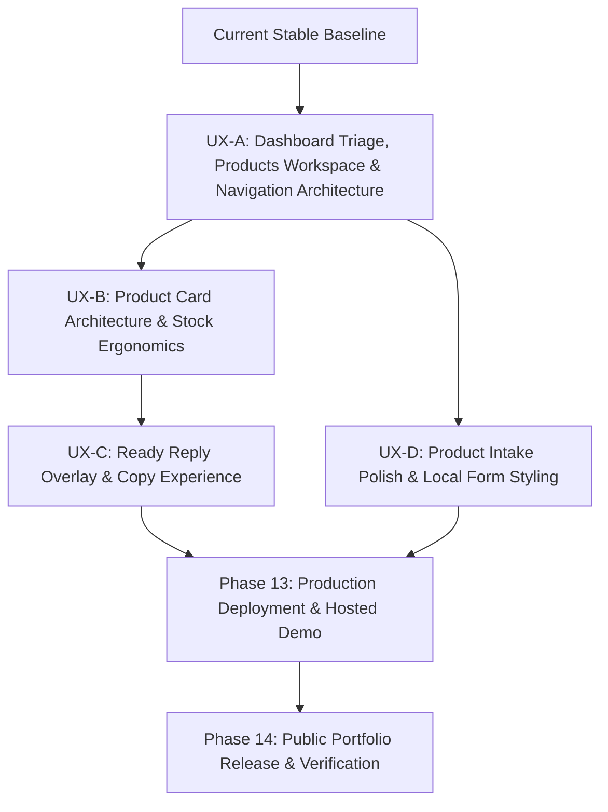

# Remaining Release Plan

**Target Application:** Portfolio V1 — Social Commerce Operating Assistant (`GITHUB_MVP_ERP`)  
**Repository Root:** `/home/giga/Desktop/OSINT/GITHUB_MVP_ERP`  
**Execution Authority Status:** Active, Bounded, Operational  
**Authority Hierarchy:**  
1. `docs/PROJECT_BIBLE.md` — Supreme canonical durable product/domain truth.  
2. `docs/REMAINING_RELEASE_PLAN.md` — Authoritative execution map for all remaining work from the current stable baseline through final portfolio release.  
3. `docs/PRE_PHASE13_PRODUCT_VISION_ALIGNMENT.md`, `docs/PRE_PHASE13_REMAINING_WORK_ANALYSIS.md`, `docs/PRE_DEPLOYMENT_CODE_UX_INVENTORY.md` — Supporting analysis and design rationale (not routine Stage context).  
4. `docs/BUILD_PLAN.md` — Historical roadmap fallback; superseded for routine remaining work by this plan.  
5. `docs/DEVELOPMENT_NOTES.md` — Operational handoff and decision ledger.

---

## 1. Purpose and Authority

This document defines the exact, bounded engineering path from the current stable V1 baseline to the final public portfolio release. 

The application backend, multi-tenant isolation, inventory concurrency engine, and heuristic NLP services are feature-complete and locally hardened. However, pre-deployment UX reconnaissance revealed significant ergonomic friction: a disjointed two-hub navigation structure, severe mobile card density, in-card layout reflow during Ready Reply expansion, and nested browser `
` accordion fatigue during product intake.

This plan authorizes **four focused pre-deployment UX micro-slices (UX-A through UX-D)** to resolve these ergonomic bottlenecks, followed immediately by **Phase 13 (Production Deployment & Hosted Demo)** and **Phase 14 (Public Portfolio Presentation & Closure)**.

---

## 2. Current Stable Baseline (Do Not Reopen)

The following capabilities are verified, stable, and **must not be reopened or refactored** during UX execution:
- **Tenant Boundary:** Every model, query, form, and mutation scopes strictly to `business=active_business`. Multi-business ambiguity returns HTTP 409.
- **Stock Authority:** Stock lives exclusively on `ProductChoice.quantity`. No product-level stock field exists.
- **Concurrency & Ledger:** Mutations route through `inventory/mutations.py` with PostgreSQL `select_for_update` row locks, appending immutable `InventoryAdjustment` records. Quantities never drop below zero.
- **Duplicate Choices:** Visible choices with identical `(size, color)` pairs are valid distinct rows and tracked by unique row IDs.
- **Decoupled Availability & Partial-Sold-Out Truth:** Stored lifecycle (`draft`, `active`, `archived`) is strictly separated from computed availability (`available`, `partially_sold_out`, `sold_out`), calculated by `inventory.availability`. Partial-sold-out behavior (some choices available, some sold out) is an established first-class state and must be preserved across attention queues, filtering, card badges, and regression coverage.
- **Readiness Checklist:** Evaluates 5 discrete buyer questions (Price, Stock, Size/Color, Type, Material), never a generic percentage progress bar.
- **Deterministic Ready Reply:** Generated Georgian replies use only confirmed structured facts. No LLM integration or hallucinated claims.
- **Description-First Name Derivation:** `Product.description` is primary; product names derive from the first sentence.
- **Synthetic Demo Seeding:** Demo reset and seeding management commands remain fully operational.

---

## 3. Product Experience Target

The product is a **fast, seller-first operating assistant** for solo apparel sellers managing Instagram, Facebook, and WhatsApp orders in Georgia.

The interface must minimize navigation, cognitive switching, repetitive typing, and uncertainty. The central design objective is:

> **The seller should rarely have to ask: “ახლა რა გავაკეთო?” (“What should I do now?”)**

At any moment, the interface must make immediately obvious:
1. **What am I looking at?** (Clear product identity, stable thumbnail, price, availability state).
2. **What needs operational attention right now?** (Attention badge counts for missing facts, low stock, partial sold out, and sold out).
3. **Which filter/search context is active?** (Visually highlighted filter chips, sticky search query preservation).
4. **Is this product available, partially sold out, or sold out?** (Unambiguous availability pills and choice summary).
5. **How do I answer an inquiring buyer in one click?** (Prominent `[მზა პასუხი]` trigger opening a non-disruptive overlay).
6. **How do I record a sale immediately without leaving my context?** (High-contrast `+1` / `-1` stepper controls with $\ge 44\text{px}$ touch targets).
7. **How do I fix missing factual information?** (Direct deep-linked correction anchors jumping straight to the field).
8. **What happened after I acted?** (Clear, immediate visual feedback; no silent changes or false success reports).
9. **What should I do next?** (The most likely next action is visually distinct and thumb-reachable).

---

## 4. UX & Product Principles

1. **Seller Task > Database Structure:** Organize around high-frequency seller jobs (*Triage*, *Search & Sell*, *Capture*), not relational database tables.
2. **Clear Complementary Surfaces:** High-level triage and business overview live on the Dashboard (`/`); daily catalog operations live in the dedicated Products Workspace (`/products/`); clear navigation and contextual return links keep routine selling fast and predictable.
3. **Scan First, Operate on Demand:** Default state emphasizes instant recognition; operational controls (steppers, readiness breakdowns) expand contextually.
4. **Preserve Seller Context Always:** Filtering, stock mutations, and overlay dismissals must never reset active search queries or scroll positions.
5. **Truth Remains Server-Owned:** HTMX is transport only. Database state and server calculations are the sole authority for stock, availability, and readiness.
6. **Deterministic Claims Only:** Buyer-facing ready replies contain only confirmed facts. Never guess or fabricate data.
7. **Progressive Structuring Over Bureaucracy:** Ingest messy Georgian text first; let deterministic recognition suggest structured facts without blocking saves.
8. **High-Frequency Actions Stay Near the Product:** Decrement stock, copy replies, and inspect variants directly on or adjacent to the product card.
9. **Subordinate Administration:** Secondary actions (editing, cloning, archiving, vocabulary taxonomy) remain tucked away until needed.
10. **Mobile-First Ergonomics (~390px):** Sized for thumb reach ($\ge 44\text{px}$ targets), zero horizontal overflow, and controlled vertical flow.
11. **Local Consistency Over Global Churn:** Visual styling and design tokens are applied and unified locally within each slice on the surfaces that slice owns, avoiding app-wide churn.

---

## 5. Pre-Deployment Scope Boundary

### What WILL Be Improved:
- **Dashboard Triage & Navigation Architecture:** Dedicated overview on `/` with actionable attention metric cards linking to the operational workspace, combined with clear current-location navigation and contextual return links.
- **Card Compression & Ergonomics:** Compressing default mobile card height (design target: $<300\text{px}$ vs current $\sim 900\text{px}$) with on-demand choice deck expansion.
- **Enlarged Touch Steppers:** Expanding `+1` / `-1` buttons to standard minimum $\ge 44\times 44\text{px}$ hit targets with instant feedback.
- **Overlay Ready Reply:** Transitioning from in-card expansion to a mobile Bottom Sheet / desktop Slide-Over drawer with sticky "Copy & Close" and honest failure recovery.
- **Form Card Modernization:** Replacing raw `
` accordions in `product_form.html` with clean form section cards and a sticky mobile save bar.
- **Instant Photo Preview:** Client-side thumbnail preview on file selection during product intake.

### What Will NOT Be Added (Strictly Deferred):
- **NO Related Products ("უხდება") / Outfit Combos:** Deferred to V2 (Bible §2.2).
- **NO Structured Garment Measurements (Waist, Inseam, Hips):** Deferred to V2 (Bible §2.2, §5.3).
- **NO Multi-Image Photo Gallery / Carousels:** Single primary image remains the V1 boundary (Bible §7.4).
- **NO Public Storefront / Buyer Catalog:** Out of V1 scope.
- **NO Customer Carts, Orders, or Reservations:** Out of V1 scope.
- **NO Meta / WhatsApp Direct Graph API Integrations:** Out of V1 scope.
- **NO SPA Frontend Rewrite (React/Vue):** Server-rendered Django + HTMX + Alpine.js remains canonical.
- **NO LLM Generation of Operational Truth:** Pure deterministic generation remains canonical.

---

## 6. Remaining Execution Map

---

## 7. Detailed Pre-Deployment UX Slices

### UX-A: Dashboard Triage, Products Workspace & Navigation Architecture

- **ID / Title:** `UX-A: Dashboard Triage, Products Workspace & Navigation Architecture`
- **Objective:** Establish clear surface separation between the high-level business overview/triage Dashboard (`/`) and the operational Products Workspace (`/products/`), with accurate global navigation and contextual return navigation.
- **Seller Outcome:**
  - On `/` (Dashboard): The seller sees a dedicated business overview answering *"What is happening in my business right now?"* via clear, scannable metric cards (*Total Products*, *Missing Information*, *Low Stock*, *Partially Sold Out*, *Sold Out*). Tapping any attention card drills down into the Products Workspace with that specific filter active.
  - On `/products/` (Products Workspace): The seller operates their catalog answering *"What do I need to work on right now?"* prioritizing search, active filter state, product cards, stock mutations, and Ready Reply, without vertical metric bloat.
  - Across all pages: The seller immediately knows where they are (Dashboard, Products, Vocabulary, Add Product) with accurate active states, and can navigate back via clear contextual return links (e.g. `← პროდუქტებზე დაბრუნება` / `← მიმოხილვაზე დაბრუნება`) without relying on browser Back.
- **Problem Being Solved:** Ambiguity between business triage and operational catalog execution, unclear global navigation active states, reliance on browser Back for task returns, and visual flattening of operational urgency signals.
- **Scope:**
  - Route `/` remains the dedicated overview/triage surface (`dashboard/views.py:DashboardView`, `templates/shell/home.html`).
  - Route `/products/` remains the dedicated operational workspace (`catalog/views.py:ProductListView`, `templates/catalog/product_list.html`).
  - Dashboard surfaces distinct, scannable metric cards:
    - *Total Products* (`total_products_count`: total active catalog count linking to `/products/`)
    - *Missing Information* (`missing_information_products`: missing price or material facts, linking to `/products/?attention=missing_information&origin=dashboard`)
    - *Low Stock* (`low_stock_choices`: choices with $\le 2$ items remaining, linking to `/products/?attention=low_stock&origin=dashboard`)
    - *Partially Sold Out* (`partially_sold_out_choices`: products with mixed availability, linking to `/products/?attention=partial_stock&origin=dashboard`)
    - *Sold Out* (`sold_out_products`: fully sold-out products, linking to `/products/?attention=sold_out&origin=dashboard`)
  - Global navigation in `templates/base.html` accurately distinguishes active surface:
    - Dashboard (`/`, `current_nav == dashboard`)
    - Products (`/products/`, `current_nav == products`)
    - Vocabulary (`/products/vocabulary/`, `current_nav == vocabulary`)
    - Add Product (`/products/add/`, `current_nav == product_create`)
    - Logout (`accounts:logout`)
    - Product Edit sets `current_nav = "product_edit"` to prevent false active highlights.
  - Contextual return navigation on task surfaces (`templates/catalog/product_form.html`, `templates/catalog/choice_vocabulary.html`, and filtered `templates/catalog/product_list.html`) provides accessible, thumb-friendly return links (`← პროდუქტებზე დაბრუნება` / `← მიმოხილვაზე დაბრუნება`).
  - Maintain `LOGIN_REDIRECT_URL = "/"` and safe return path validators (`get_safe_product_return_url`, `get_canonical_product_workspace_return_url`).
- **Explicit Exclusions:**
  - No alterations to underlying query logic in `dashboard/attention.py`.
  - No changes to card internals or stepper layout (strictly owned by UX-B).
  - No changes to Ready Reply panel overlay or copy generator (strictly owned by UX-C).
  - No changes to product intake / edit form field composition (strictly owned by UX-D).
  - No new product features (related products, garment measurements, multi-image gallery).
- **Protected Invariants:** Business tenant isolation; URL-backed search and filter parameters; centralized availability and partial-sold-out states; HTMX transport error recovery; inventory ledger truth.
- **Primary Surfaces:**
  - `dashboard/views.py` (`DashboardView`)
  - `templates/shell/home.html`
  - `catalog/views.py` (`ProductListView`, `ProductCreateView`, `ChoiceVocabularyView`, `ProductMutationBusinessMixin`)
  - `templates/base.html`
  - `templates/catalog/product_list.html`
  - `templates/catalog/product_form.html`
  - `templates/catalog/choice_vocabulary.html`
  - `static/css/app.css`
- **Backend Impact:** `LOW`. Preserves existing `dashboard.attention` queries and `ProductListView` workspace filters; surfaces total active product count on Dashboard.
- **Key Interaction Behavior:**
  - Dashboard metric cards provide 1-click drilldowns into the Products Workspace with `?attention=<filter>&origin=dashboard`.
  - Filtered Products Workspace clearly displays active filter state and provides a return link (`← მიმოხილვაზე დაბრუნება`) to Dashboard.
  - Top navigation links highlight only the current active surface.
  - Task surfaces provide prominent contextual return actions.
- **Desktop Expectations:** Clear, high-contrast Dashboard metric cards with distinct status accents. Clean horizontal top navigation with single active indicator.
- **~390px Mobile Expectations:** Thumb-friendly touch targets ($\ge 44\text{px}$) for cards, nav items, and return links. Mobile-first vertical hierarchy protecting Products workspace from unnecessary dashboard bloat.
- **Accessibility Expectations:** Accurate `aria-current="page"` on active navigation items. High-contrast status badges. Clear semantic headings and region landmarks.
- **Failure / Recovery Expectations:** URL query parameters drive filtering state, preserving full-page reload and bookmarking fidelity. HTMX errors retain retry/recovery options.
- **Acceptance Criteria:**
  1. Visiting `/` renders the dedicated Dashboard with Total Products and attention metric cards.
  2. Visiting `/products/` renders the operational Products Workspace with search, filters, and product cards without duplicating dashboard metrics.
  3. Clicking any attention card on Dashboard navigates to `/products/?attention=<filter>&origin=dashboard` and displays the contextual return link.
  4. Global navigation marks only the current surface as active (`aria-current="page"`).
  5. Task surfaces (Add, Edit, Vocabulary) provide clear contextual return links without relying on browser Back.
  6. Business isolation and unauthenticated redirects remain enforced.
- **Suggested Stage 3 Focused Verification:**
  - Test `/` view status code, context variables (`total_products_count`, `attention`), and active business scoping.
  - Test `/products/` view status code, search parameters, and workspace return context.
  - Test drilldown from dashboard attention URLs into filtered workspace results.
  - Test top navigation active state isolation across Dashboard, Products, Vocabulary, and Product Add.
- **Neighboring Regression Boundary:** Verify that search query parameter (`q`) and pagination (`page`) still work when attention filters are active.
- **Stage 4 Audit Focus:** Confirm no cross-business leakage in attention counts or filtered product IDs.
- **Stage 5 Final Verification:** Full regression suite passes on PostgreSQL.
- **Owner Test Scenario:** Log in. Confirm landing on `/` (Dashboard). Verify Total Products and attention cards are displayed. Click an attention card; verify navigation to `/products/?attention=...` with active filter and return link. Verify top navigation reflects current location accurately.
- **Commit Intent:** `feat(dashboard,catalog): align dashboard triage and products workspace architecture`
- **Dependency / Next Slice:** None; prerequisite for UX-B and UX-D.

---

### UX-B: Product Card Information Architecture / Mobile Scanning / ProductChoice & Stock Ergonomics

- **ID / Title:** `UX-B: Compact Scan-First Product Cards & Stock Stepper Ergonomics`
- **Objective:** Compress product card vertical height and introduce on-demand progressive disclosure for choice steppers and readiness details.
- **Seller Outcome:** Mobile card height compresses dramatically (design target: $<300\text{px}$ vs current $\sim 900\text{px}$). The seller can scan multiple items per screen. Tapping "მართვა" expands large, touch-friendly `+1` / `-1` stepper buttons with controlled, predictable vertical expansion.
- **Problem Being Solved:** Current cards render all choices, steppers, and readiness checks fully expanded, creating an unbearable scroll wall on mobile devices.
- **Scope:**
  - Redesign `templates/catalog/_product_card.html` into a "Scan First, Operate on Demand" layout:
    - **Header Row:** Thumbnail (design target: $90\times 90\text{px}$ square, non-stretched, `object-fit: cover`), Title, Price in bold GEL, Product Type, Availability pill (`ხელმისაწვდომია`, `ნაწილობრივ ამოიწურა`, `ამოიწურა`).
    - **Summary Strip:** Total stock badge (`მარაგშია: X ცალი`) + compact choice preview string (e.g. `S: 1 · M: 2 · L: 0`).
    - **Primary Action Row:** `[მზა პასუხი]`, `[მარაგი / მართვა ▼]`, and compact `[•••]` overflow menu.
  - **Expandable Choice Deck:** Disclosed on demand when tapping `[მარაგი / მართვა ▼]`. Contains:
    - Individual Size $\times$ Color choice rows with clear choice identity.
    - Enlarged touch stepper buttons (`−1` and `+1`) with minimum $44\times 44\text{px}$ hit areas.
    - Inline editable quantity chip replacing clumsy `
` exact set forms.
    - Readiness summary checklist with targeted correction links.
  - **Subordinate Action Menu (`•••`):** Clean dropdown or popover containing `[რედაქტირება]`, `[მსგავსის დამატება]`, `[დაარქივება]`.
  - Independent expansion state (expanding Card B does not collapse Card A).
- **Explicit Exclusions:** No changes to `inventory/mutations.py` or ledger models; Ready Reply presentation handled separately in UX-C.
- **Protected Invariants:** Choice-level stock authority; concurrency locking (`select_for_update`); prevention of negative stock; duplicate choice identity preservation; centralized availability and partial-sold-out semantics.
- **Primary Surfaces:**
  - `templates/catalog/_product_card.html`
  - `templates/catalog/_product_results.html`
  - `static/css/app.css`
  - `static/js/product_workspace.js`
- **Backend Impact:** `NONE`. Template and styling refactor using existing context dictionaries.
- **Key Interaction Behavior:**
  - Tapping `[მარაგი / მართვა ▼]` smoothly expands the choice deck directly inside the card.
  - Expansion is **controlled and predictable**: it expands the target card downward without shifting focus, without resetting scroll position, and without disturbing active search or filter parameters.
  - Tapping `+1` or `-1` sends HTMX POST, updates choice quantity in place, flashes an update highlight, updates the total stock pill, and announces to screen readers.
  - Tapping exact quantity opens a minimal inline input without expanding row height.
- **Desktop Expectations:** Cards sit in a responsive grid or compact list (design target: $\sim 160\text{px}$ height unexpanded). Expanding choice deck opens downward cleanly.
- **~390px Mobile Expectations:** Card height is compact (design target: $<300\text{px}$ unexpanded). Touch targets for steppers are $\ge 44\times 44\text{px}$. Thumbnail is non-stretched.
- **Accessibility Expectations:** Stepper buttons have `aria-label="დააკელი 1"` / `"დაამატე 1"`. Expanding deck toggles `aria-expanded="true/false"`. Live region announces stock transitions (`role="status"`).
- **Failure / Recovery Expectations:** If stock mutation fails (e.g. negative stock attempt or network error), the card displays an inline error alert and restores the confirmed server quantity.
- **Acceptance Criteria:**
  1. Default mobile card height is compact and scannable for multi-choice products.
  2. Tapping "მართვა" reveals choice rows, steppers, and readiness breakdown without loss of scroll position.
  3. Stepper hit areas measure $\ge 44\times 44\text{px}$ on touch screens.
  4. In-place `+1` / `-1` mutations update stock and ledger correctly via existing endpoints.
  5. Availability pill properly reflects `partially_sold_out` when some choices are 0.
  6. Secondary actions (`რედაქტირება`, `დაარქივება`) are grouped into the overflow menu.
- **Suggested Stage 3 Focused Verification:**
  - Verify card rendering for single-choice, multi-choice, partial-sold-out, and zero-choice draft items.
  - Test HTMX stock delta endpoints against redesigned stepper markup.
  - Test stock mutation error response rendering.
- **Neighboring Regression Boundary:** Ensure pagination controls and search bar continue to target `#product-workspace-results` properly.
- **Stage 4 Audit Focus:** Confirm that total stock and availability pills update synchronously when individual choices change.
- **Stage 5 Final Verification:** Full regression suite passes on PostgreSQL.
- **Owner Test Scenario:** On mobile (~390px), scan the product list. Tap "მართვა" on a dress. Tap `+1` on size M; confirm quantity updates. Tap `-1` to 0; confirm choice updates to sold out and card status reflects partial availability if other choices remain in stock.
- **Commit Intent:** `feat(cards): implement compact scan-first layout and ergonomic steppers`
- **Dependency / Next Slice:** Depends on UX-A; prerequisite for UX-C.

---

### UX-C: Ready Reply Overlay & Copy Experience

- **ID / Title:** `UX-C: Ready Reply Responsive Bottom Sheet & Desktop Slide-Over`
- **Objective:** Replace in-card DOM expansion with a non-disruptive mobile bottom sheet and desktop slide-over drawer with a sticky "Copy & Close" action.
- **Seller Outcome:** Tapping "მზა პასუხი" opens a focused overlay over the workspace without shifting card positions. The seller taps "დაკოპირება და დახურვა" directly under their thumb, copies the message, dismisses the sheet, and switches to Instagram in seconds.
- **Problem Being Solved:** The current inline expansion pushes the card downward by 300px, displacing surrounding cards and pushing the copy button below the mobile viewport fold.
- **Scope:**
  - Refactor `templates/catalog/_ready_reply_panel.html` into a responsive overlay:
    - **On Mobile ($<720\text{px}$):** Renders as a fixed **Bottom Sheet** anchored to the base of the viewport with a subtle backdrop.
    - **On Desktop ($\ge 720\text{px}$):** Renders as a **Slide-Over Drawer** anchored to the right viewport edge (design target: $\sim 420\text{px}$ width).
  - Prominent sticky primary button: `[დაკოპირება და დახურვა]` (Copy & Close).
  - Instant clipboard copy via `navigator.clipboard.writeText` with manual select fallback if permission is denied.
  - **Strict Failure Semantics:**
    - **SUCCESSFUL copy:** success feedback appears; sheet auto-dismisses or closes cleanly.
    - **FAILED / DENIED copy:** MUST NOT report success; MUST NOT auto-close before seller recovers; overlay remains open; fallback selection and clear manual-copy instructions remain visible; focus remains usable; confirmed reply text remains available.
  - Seller-only warnings (e.g. missing price/fabric) displayed in distinct amber alert boxes with deep links to correction.
  - Keyboard trap: listens for `Escape` to dismiss and restores focus to opening trigger button.
- **Explicit Exclusions:** No modifications to deterministic generation rules in `catalog/ready_reply.py`.
- **Protected Invariants:** Reply text contains only confirmed structured facts; seller-only warnings never enter copied clipboard text; sold-out items never claim availability; partial availability is accurately stated.
- **Primary Surfaces:**
  - `templates/catalog/_ready_reply_panel.html`
  - `static/js/product_workspace.js`
  - `static/css/app.css`
- **Backend Impact:** `NONE`. Reuses existing `ReadyReplyView` (`catalog/views.py`).
- **Key Interaction Behavior:**
  - Tapping `[მზა პასუხი]` fetches the panel via HTMX into `#ready-reply-root`.
  - Sheet slides up smoothly without displacing background cards. Keyboard focus moves to the panel container.
  - Tapping `[დაკოპირება და დახურვა]` attempts clipboard copy.
    - On success: flashes green toast ("დაკოპირებულია!"), closes sheet, and restores focus to trigger.
    - On error/denial: highlights text area, shows manual copy instructions, and keeps overlay open.
  - Tapping backdrop or pressing `Escape` dismisses sheet without copying.
- **Desktop Expectations:** Slides in from the right edge; underlying workspace remains visible and undisturbed.
- **~390px Mobile Expectations:** Slides up from bottom edge, occupying max 70% viewport height. Copy button is permanently anchored at screen bottom.
- **Accessibility Expectations:** Panel has `role="dialog"`, `aria-modal="true"`, and `aria-labelledby`. Focus is trapped inside dialog while open and restored to trigger on close.
- **Failure / Recovery Expectations:** If clipboard API fails or is blocked by browser permissions, text area is auto-selected and focused with clear Georgian instructions to copy manually (`Ctrl+C` / long-press).
- **Acceptance Criteria:**
  1. Opening Ready Reply causes zero layout shift on product cards in the background.
  2. Mobile view renders as a Bottom Sheet; desktop renders as a right-hand Slide-Over.
  3. "დაკოპირება და დახურვა" copies text to clipboard and dismisses overlay on success.
  4. Clipboard failure NEVER reports false success and NEVER auto-closes the overlay.
  5. Seller-only alerts (missing facts) never appear in copied clipboard text.
  6. Pressing `Escape` or clicking backdrop closes the overlay cleanly and restores focus.
- **Suggested Stage 3 Focused Verification:**
  - Test `ReadyReplyView` response structure and confirmed facts rendering.
  - Test HTMX endpoint response status for available, partially sold out, and sold-out products.
- **Neighboring Regression Boundary:** Verify that opening and closing Ready Reply does not disrupt active search terms or scroll position.
- **Stage 4 Audit Focus:** Confirm that no unconfirmed candidate facts or seller warning notes leak into the clipboard payload.
- **Stage 5 Final Verification:** Full regression suite passes on PostgreSQL.
- **Owner Test Scenario:** Search for a product. Tap "მზა პასუხი" on mobile. Verify bottom sheet rises without background card jump. Tap "დაკოპირება და დახურვა". Verify toast, overlay close, and paste clipboard text into external notepad to verify content.
- **Commit Intent:** `feat(reply): introduce responsive bottom sheet and slide-over drawer`
- **Dependency / Next Slice:** Depends on UX-B.

---

### UX-D: Product Intake & Correction Polish

- **ID / Title:** `UX-D: Streamlined Product Intake, Media Preview & Form Polish`
- **Objective:** Modernize the single-page product creation and editing canvas, eliminate raw `
` accordion fatigue, add instant photo previews, and introduce a sticky mobile action bar.
- **Seller Outcome:** Creating or editing an item feels fast and guided: pasting a description immediately suggests structured attributes; selecting a photo provides an instant thumbnail preview; required fields are visually clear; and the "შენახვა" (Save) button is permanently reachable on mobile.
- **Problem Being Solved:** The current form hides important sections inside unstyled browser `
` tags, displays raw taxonomy management directly inside daily choice rows, lacks instant image preview, and hides the save button at the very bottom of a tall page.
- **Scope:**
  - Modernize `templates/catalog/product_form.html`:
    - Replace raw browser `
` with clean, styled form section cards:
      - **Card 1 (Core Identity):** Description textarea + Live Recognition Preview + Price + Primary Media upload.
      - **Card 2 (Choices & Quantities):** Size $\times$ Color matrix table with quick quantity inputs.
      - **Card 3 (Materials & Classification):** Canonical fiber percentages and optional Product Type/Tag selectors.
  - **Instant Media Preview:** Attach lightweight client-side `FileReader` in `product_workspace.js` to render selected photo thumbnail immediately upon file selection.
  - **Vocabulary De-Emphasis:** Move custom size/color vocabulary addition forms into a cleanly collapsed secondary card below the choice matrix (*"ახალი ზომის/ფერის დამატება ლექსიკონში"*).
  - **Sticky Mobile Action Bar:** Anchor `[შენახვა]` (Save) and `[გაუქმება]` (Cancel) in a persistent bottom toolbar on mobile screens ($<720\text{px}$).
  - **Correction Anchor Smooth Scrolling:** Ensure deep-linked correction URLs (e.g. `/products/1/edit/#material-section`) scroll smoothly and highlight the target card.
  - **Local Visual Consistency:** Unify typography weights, button padding, border radiuses, and status pill colors strictly on the Create/Edit/Correction surfaces owned by UX-D (not an app-wide redesign).
- **Explicit Exclusions:** No alterations to multi-formset bundle persistence logic in `catalog/product_bundles.py`; no multi-step wizard (single page retained); no app-wide CSS overhaul.
- **Protected Invariants:** Atomic bundle validation; Draft vs Active choice constraints (Active strictly requires $\ge 1$ choice); safe return URL validation.
- **Primary Surfaces:**
  - `templates/catalog/product_form.html`
  - `templates/catalog/_choice_section.html`
  - `templates/catalog/_material_section.html`
  - `static/css/app.css`
  - `static/js/product_workspace.js`
- **Backend Impact:** `NONE`. Template, CSS, and lightweight client JS only.
- **Key Interaction Behavior:**
  - Typing in description textarea triggers live debounced HTMX recognition preview.
  - Tapping "არჩევანში გამოყენება" on a recognized token transfers it to a choice row with smooth visual feedback.
  - Selecting a photo file displays the image immediately in the preview box without waiting for form submission.
  - Mobile sellers scroll through the form while the save bar remains sticky and ready at the bottom of the viewport.
- **Desktop Expectations:** Form sections render as clean, distinct white cards on soft gray background. Save actions sit at both top and bottom of canvas.
- **~390px Mobile Expectations:** Sticky bottom action bar with full-width primary save button. Clean vertical form stacking with no horizontal overflow.
- **Accessibility Expectations:** Form inputs link to error alerts via `aria-describedby` and `aria-errormessage` (`syncFieldErrors()`). Sticky bar does not obscure form content (bottom padding added to container).
- **Failure / Recovery Expectations:** Server validation errors display field-local error messages and a top-level alert summary; scroll jumps to the first invalid field.
- **Acceptance Criteria:**
  1. Product form displays clean structured section cards instead of raw browser accordions.
  2. Selecting an image file displays an instant thumbnail preview.
  3. Inline vocabulary forms are moved below choices into a collapsed secondary card.
  4. Sticky bottom action bar remains visible and functional during mobile scrolling.
  5. Saving valid Active and Draft products persists cleanly via existing bundle services.
- **Suggested Stage 3 Focused Verification:**
  - Test `ProductCreateView` and `ProductUpdateView` submission with valid and invalid payloads.
  - Test candidate token transfer into formsets.
  - Verify error summary rendering for missing choices on Active products.
- **Neighboring Regression Boundary:** Verify that canceling returns safely to the parent Products workspace (`/products/`) without losing workspace filter context.
- **Stage 4 Audit Focus:** Confirm that atomic transaction rollback works properly if media or choices fail validation.
- **Stage 5 Final Verification:** Full regression suite passes on PostgreSQL.
- **Owner Test Scenario:** Navigate to `/products/add/`. Select a photo; confirm instant preview. Paste description "შავი სელის კაბა, 100% სელი, S და M, 85 ლარი". Confirm recognition chips. Transfer choices. On mobile viewport, confirm sticky save bar is visible; tap "შენახვა". Confirm product appears in Products workspace.
- **Commit Intent:** `feat(forms): modernize product intake, instant photo preview, and sticky actions`
- **Dependency / Next Slice:** Depends on UX-A; can run in parallel with or following UX-B/UX-C. Completes pre-deployment UX scope.

---

## 8. Deployment Phase (Phase 13 Continuation)

Upon completion and verification of slices UX-A through UX-D, deployment proceeds under the established Phase 13 mandate:

### P13.1 Deployment Target and Production Configuration
- **Objective:** Select and configure a backend-capable hosting path (Render, Railway, Fly.io, or equivalent) running real Django + PostgreSQL + HTTPS.
- **Scope:** Production settings configuration (`DEBUG=False`, secret key enforcement, explicit `ALLOWED_HOSTS` and `CSRF_TRUSTED_ORIGINS`, database URL parsing via `dj-database-url` or native env, static collection, secure cookies, intentional media storage strategy appropriate to the selected platform without assuming ephemeral container disk is durable).
- **Exclusions:** GitHub Pages runtime; SQLite production deployment; feature changes.
- **Acceptance:** Secure production settings validated; configuration check passes.
- **Commit Intent:** `chore: configure production deployment` (only if a real tracked configuration change is required).

### P13.2 Hosted Application and PostgreSQL Provisioning
- **Objective:** Deploy the exact Git revision to the hosting provider and provision the PostgreSQL database.
- **Scope:** Platform provisioning; running migrations; collecting production static assets; configuring media storage; health-check verification.
- **Exclusions:** Untracked manual server patches; dummy data imports.
- **Acceptance:** Application boots successfully; PostgreSQL schema is current; HTTPS functions; health check returns 200 OK.
- **Commit Intent:** `chore: prepare hosted django demo` (only if a real tracked change is required).

### P13.3 Demo Seed, Hosted Smoke Test, and Owner Acceptance
- **Objective:** Prove the hosted authenticated synthetic demo operates flawlessly for an external portfolio reviewer.
- **Scope:** Seed synthetic demo catalog; verify login, Dashboard triage, Products workspace, compact cards, stock steppers, Ready Reply bottom sheet, product capture, and demo reset; add verified demo URL to documentation.
- **Exclusions:** Real customer data; public storefront claims.
- **Acceptance:** Live demo accessible; PostgreSQL mutations persist; reset command restores baseline; mobile smoke test passes.
- **Owner Test:** **REQUIRED** — Owner executes full demo walkthrough on phone (~390px) and desktop; replies `TEST PASS`.
- **Commit Intent:** `docs: publish verified demo access` (only after live proof).

---

## 9. Public Release Phase (Phase 14 Continuation)

### P14.1 Final Integrity, Scope, Security, and Drift Audit
- **Objective:** Ensure that code, documentation, tests, Git history, and public claims tell one unified, truthful story.
- **Scope:** Full repository audit; verification that deferred items (Related Products, Garment Measurements, Storefront) are not falsely claimed; secret scanning; clean Git tree.
- **Acceptance:** Zero release-blocking drift; no private credentials in repository; all invariants intact.
- **Commit Intent:** `chore: complete portfolio integrity audit` (only if a real tracked change is required; no ceremonial commits).

### P14.2 Public README and Portfolio Presentation
- **Objective:** Present the completed project to engineering hiring managers with professional clarity.
- **Scope:** High-impact README containing canonical product thesis, live demo URL and credentials, key architectural proofs (concurrency ledger, heuristic NLP, tenant isolation), verified mobile screenshots, and setup instructions.
- **Acceptance:** GitHub landing experience is externally compelling and technically rigorous.
- **Owner Test:** **REQUIRED** — Review README and live demo links; reply `TEST PASS`.
- **Commit Intent:** `docs: finalize portfolio presentation`

### P14.3 Owner Public Release Closure
- **Objective:** Close Portfolio V1 release with formal owner sign-off.
- **Scope:** Final verification of clean public `main` branch, green CI, and healthy hosted demo.
- **Acceptance:** Owner issues `TEST PASS / RELEASE APPROVED`. Gate 7 passes.
- **Commit Intent:** `chore: close portfolio v1 release` (only if a real tracked change is required).

---

## 10. Verification & Owner Gates

| Gate | Associated Slices | Verification Requirement | Owner Gate |
| :--- | :--- | :--- | :--- |
| **UX Quality Gate** | UX-A, UX-B, UX-C, UX-D | Full test suite passes; zero regressions in tenant isolation, stock ledger, partial-sold-out states, or readiness; manual check on 390px mobile viewport. | Owner reviews enhanced local experience on desktop and mobile. |
| **Gate 6 (Deployment)** | P13.1, P13.2, P13.3 | Hosted Django + PostgreSQL live; HTTPS valid; synthetic demo seeded; smoke test passes. | Owner executes live hosted demo walkthrough; issues `TEST PASS`. |
| **Gate 7 (Final Release)** | P14.1, P14.2, P14.3 | Repository hygiene clean; README accurate with screenshots and demo link; green CI on `main`. | Owner reviews public portfolio landing; issues `TEST PASS / RELEASE APPROVED`. |

---

## 11. Context-Economy Contract (For Future Codex Sessions)

To prevent context exhaustion and token waste in future agent sessions, all subsequent work must follow this strict context protocol:

1. **Do NOT routinely read old documents:** Do not reload `docs/BUILD_PLAN.md`, `docs/PRE_DEPLOYMENT_CODE_UX_INVENTORY.md`, `docs/PRE_PHASE13_REMAINING_WORK_ANALYSIS.md`, `docs/PRE_PHASE13_PRODUCT_VISION_ALIGNMENT.md`, or `docs/archive/`.
2. **Routine Context per Task:**
   - Read `docs/PROJECT_BIBLE.md` only when a concrete durable domain invariant is in question.
   - Read **ONLY the specific slice section** in `docs/REMAINING_RELEASE_PLAN.md` currently being executed.
   - Inspect listed Primary Surfaces first.
   - **Allowed Expansion:** An agent MAY expand inspection to directly required callers, consumers, templates, JavaScript files, services, or regression tests when concrete implementation evidence requires it.
   - **Minimal Operational Handoff:** An agent MAY read the minimal latest operational handoff from the end of `docs/DEVELOPMENT_NOTES.md` when closure, owner decisions, or CI state is needed.
3. **Linear Append-Only Logging:** Execution progress, test results, and owner confirmations write exclusively to the bottom of `docs/DEVELOPMENT_NOTES.md`.

---

## 12. Final Definition of Done

Portfolio V1 is **COMPLETE** when:
1. Slices UX-A, UX-B, UX-C, and UX-D are fully implemented, verified, and merged.
2. The Dashboard and Products Workspace function as fast, complementary, mobile-friendly operating surfaces.
3. All core domain invariants (tenant isolation, stock row locking, immutable ledgering, partial-sold-out integrity, deterministic readiness, and safe reply generation) remain 100% intact.
4. The application is deployed live to backend-capable hosting with PostgreSQL and HTTPS.
5. The synthetic demo is seeded, tested, and verified on desktop and mobile viewports.
6. The public README provides a compelling engineering portfolio narrative with verified live access.
7. The owner issues formal release approval: `TEST PASS / RELEASE APPROVED`.
